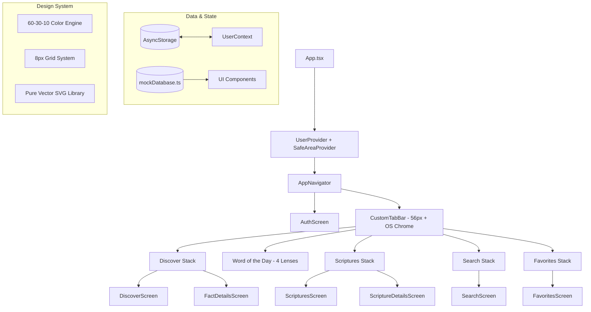

# exégeomai (ἐξηγέομαι)

> **Strong's Greek 1834**: *ἐξηγέομαι* (*exēgeomai*) — from *ἐκ* (out) and *ἡγέομαι* (to lead): **"to lead out, unfold, declare, interpret, draw out the true meaning."** As recorded in John 1:18: *"No one has seen God at any time; the only begotten Son, who is in the bosom of the Father, He has explained / declared (exēgēsato) Him."*

**exégeomai** is a modern, high-performance React Native & Expo mobile application exploring ancient historical context, cultural customs, original language deep dives (Strong's Concordance), and multi-lens daily devotionals from Sacred Scripture.

---

## Architecture Overview



---

## Design System & Specifications

The application strictly implements the **60-30-10 Design Rule** and mobile layout standards:

### 1. 60-30-10 Color Hierarchy
- **60% Dominant Background**: Deep Obsidian Midnight (`#0B0F19`)
- **30% Panel / Surface**: Slate Navy (`#131B2E`) with subtle borders (`#1C263D`) and elevated surfaces (`#18223A`)
- **10% Accent**: Warm Amber Gold (`#F59E0B`) with soft amber tint (`rgba(245, 158, 11, 0.14)`)
- **Neutral Typography**: Primary Pure White (`#FFFFFF`), Secondary Slate (`#94A3B8`), and Muted Slate (`#64748B`)
- *Strict Rule: No rainbow status tags or ad-hoc coloring.*

### 2. Spacing Grid (Multiples of 8px)
All margins, paddings, gaps, and component sizes follow multiples of **8px**:
- `spacing.sm`: `8px`
- `spacing.md`: `16px` (Default screen margin and gutter)
- `spacing.lg`: `24px`
- `spacing.xl`: `32px`
- `spacing.xxl`: `48px`
- `spacing.nav`: `56px` (Base app bar / tab bar content height)
- `spacing.huge`: `64px`

### 3. Platform Navigation Chrome & Layout Specs
- **Android Target**:
  - Status Bar: `24px`
  - App Bar: `56px`
  - Bottom Nav Chrome: `56px` content + `48px` navigation / gesture bar (`104px` total)
  - Base Screen: `360 × 640 dp`
  - Grid: `4-column grid`, `16px margin`, `16px gutter`
- **iOS Target**:
  - Status Bar: `54px`
  - Navigation Bar: `96px`
  - Bottom Tab Bar: `56px` content + `34px` home indicator (`90px` total)
  - Base Screen: `393 × 852 pt`
  - Grid: `4-column grid`, `16px margin`, `16px gutter`
- **Safe Area Inset Management**: `SafeAreaView` and `useSafeAreaInsets()` dynamically safeguard all platform notches and gesture areas.

### 4. Pure Vector SVG System
In strict adherence to design guidelines, emojis and icon font bundles have been replaced with dedicated, scalable vector SVGs using `react-native-svg`:
- **Navigation**: `DiscoverSvg`, `WotdSvg`, `ScripturesSvg`, `SearchSvg`, `FavoritesSvg`
- **Interactions**: `FlameSvg`, `RefreshSvg`, `ShareSvg`, `ChevronRightSvg`, `BackArrowSvg`, `CloseSvg`, `CheckSvg`
- **Scholarly Study**: `LandmarkSvg` (Historical Context), `UsersSvg` (Cultural Practices), `QuoteSvg`, `StrongsIconSvg`, `CalendarSvg`
- **WOTD Analytical Lenses**: `OriginalIntentSvg` (Clock), `TheologicalTruthSvg` (Cross), `ModernWalkSvg` (Footsteps), `PrayerFocusSvg` (Hands)
- **Biblical Genres**: `GenreLawSvg`, `GenreHistorySvg`, `GenreWisdomSvg`, `GenreProphecySvg`, `GenreGospelSvg`, `GenreEpistleSvg`, `GenreApocalypticSvg`
- **Auth Providers**: `GoogleSvg`, `AppleSvg`

---

## Features

1. **Daily Fact Discovery**
   - Interactive rotating biblical discoveries.
   - Comprehensive breakdowns of the verse, historical backdrop, and cultural customs.
   - Strong's Concordance deep dive with original Hebrew/Greek lemmas, transliterations, and theological definitions.
   - Daily reading streak and cumulative fact counter.

2. **Word of the Day (WOTD) 4-Lens Analytical Engine**
   - **Original Intent**: The historical, textual, and grammatical context as understood by the original audience.
   - **Theological Truth**: Eternal doctrines and revelation of God's character.
   - **Modern Walk**: Concrete, practical life applications for believers today.
   - **Prayer Focus**: Guided prayers based on the verse.
   - Memory verse retention system and daily completion tracking.

3. **Scripture Library**
   - Multi-category browser filterable by Testament (*Old Testament*, *New Testament*) and Genre (*Law, History, Wisdom, Prophecy, Gospel, Epistle, Apocalyptic*).
   - Fast keyword matching on book, chapter, and verse range.

4. **Contextual Search**
   - Unified instant search across both curated fun facts and the biblical scripture repository.
   - Category filtering (*People, Prophecy, Customs, History, Language, Scriptures Only*).

5. **Personal Offline Collection (Favorites)**
   - Persistent offline bookmarking for facts, scriptures, and completed devotional entries.
   - Powered by `@react-native-async-storage/async-storage`.

6. **Local Push Notifications**
   - Scheduled daily morning notifications powered by `expo-notifications` delivering fresh biblical insights.

---

## Directory Structure

```text
exegeomai/
├── assets/                       # App icons, adaptive icons, and splash assets
│   ├── adaptive-icon.png
│   ├── favicon.png
│   ├── icon.png
│   └── splash-icon.png
├── src/
│   ├── components/               # Modular UI components
│   │   ├── Card.tsx              # Surface-contained cards with 8px spacing
│   │   ├── CustomTabBar.tsx      # Platform chrome-aware bottom navigation bar
│   │   ├── FactCard.tsx          # Comprehensive biblical fact card component
│   │   ├── ScriptureCard.tsx     # Scripture card with genre vector badges
│   │   ├── SearchBar.tsx         # Search input with clear button and chips
│   │   ├── SvgIcons.tsx          # Pure vector SVG library (zero emojis)
│   │   ├── Typography.tsx        # Standardized typography hierarchy
│   │   └── WOTDCard.tsx          # Word of the Day devotional card
│   ├── context/
│   │   └── UserContext.tsx       # Global user profile, streaks, and favorites state
│   ├── data/
│   │   └── mockDatabase.ts       # Curated scriptures, facts, and Strong's database
│   ├── navigation/
│   │   └── AppNavigator.tsx      # Tab and stack navigation architecture
│   ├── screens/                  # Application views
│   │   ├── AuthScreen.tsx        # Streamlined onboarding & login
│   │   ├── DiscoverScreen.tsx    # Primary daily fact discovery view
│   │   ├── FactDetailsScreen.tsx # In-depth modal sheet for biblical facts
│   │   ├── FavoritesScreen.tsx   # Saved collection (Facts, Scriptures, WOTD)
│   │   ├── HomeScreen.tsx        # Alternate home showcase
│   │   ├── ScriptureDetailsScreen.tsx # In-depth modal sheet for scripture texts
│   │   ├── ScripturesScreen.tsx  # Categorized biblical scripture library
│   │   ├── SearchScreen.tsx      # Unified search interface
│   │   ├── WOTDDetailsScreen.tsx # Deep-dive view for Word of the Day
│   │   └── WOTDScreen.tsx        # Daily devotional with 4 analytical lenses
│   ├── services/
│   │   └── notifications.ts      # Expo notifications handler and scheduler
│   └── theme/
│       ├── colors.ts             # Strict 60-30-10 color tokens
│       └── index.ts              # Spacing (8px grid), platform specs, and radius
├── App.tsx                       # Root container and context providers
├── app.json                      # Expo configuration
├── index.ts                      # Expo entrypoint
├── package.json                  # Dependencies and scripts (concurrently dev runner)
├── tsconfig.json                 # TypeScript compiler configuration
└── README.md                     # Comprehensive project architecture guide
```

---

## Getting Started

### Prerequisites
- Node.js (v18+) or Bun (v1.0+)
- Expo CLI (`npx expo`)
- Expo Go app on iOS or Android (or a physical simulator/emulator)

### Installation
```bash
# Install project dependencies
bun install
# or
npm install
```

### Running Locally (Rule 15 Concurrently Runner)
Development uses `concurrently --kill-others-on-fail --raw` with fixed port `8082` to avoid interactive prompts and render the Expo QR code cleanly:

```bash
# Start development server on pinned port 8082
npm run dev
# or
bun run dev
```

### Platform Commands
```bash
# Run on Android
npm run android

# Run on iOS
npm run ios

# Run in Web Browser
npm run web
```

### Type Checking & Validation
```bash
# Verify TypeScript compilation with zero errors
bun x tsc --noEmit
# or
npx tsc --noEmit
```

---

## License & Credits
Crafted for Scripture scholars, Bible study groups, and everyday believers seeking the deeper historical, linguistic, and cultural dimensions of God's Word.
