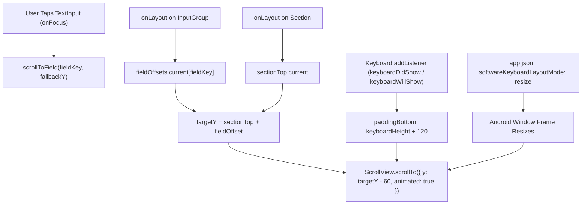
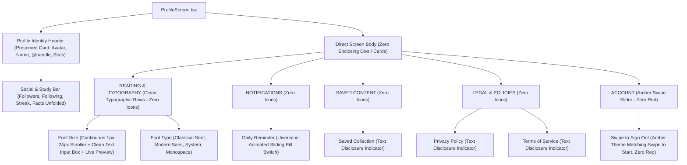
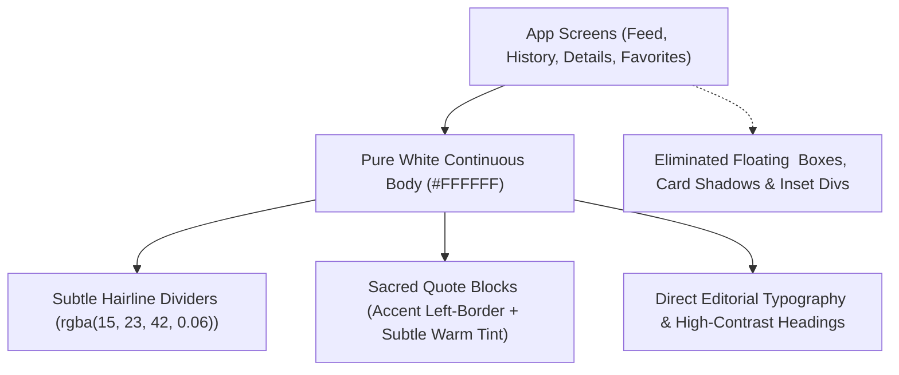
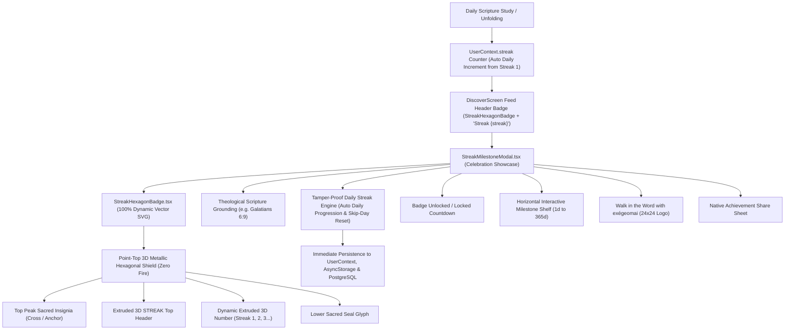
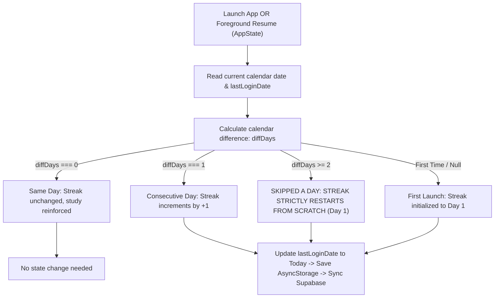

# exégeomai (ἐξηγέομαι)

<p align="left">
  
  
  
  
  
  
  
  
  
  
  
  
  
  
  
  
  
  
  
  
</p>

> **Strong's Greek 1834**: *ἐξηγέομαι* (*exēgeomai*) — from *ἐκ* (out) and *ἡγέομαι* (to lead): **"to lead out, unfold, declare, interpret, draw out the true meaning."** As recorded in John 1:18: *"No one has seen God at any time; the only begotten Son, who is in the bosom of the Father, He has explained / declared (exēgēsato) Him."*

**exégeomai** is a modern, high-performance React Native & Expo mobile application exploring ancient historical context, cultural customs, original language deep dives (Strong's Concordance), full 66-book scripture reading, believer community discovery, and multi-lens daily devotionals from Sacred Scripture.

---

## Architecture Overview

```mermaid
graph TD
    App["App.tsx"] --> Providers["UserProvider + SafeAreaProvider"]
    Providers --> Nav["AppNavigator"]
    Providers --> UpdateModal["UpdateModal (Update Now / Remind Me Later)"]
    Nav --> Welcome["WelcomeScreen (3-Step Onboarding Flow)"]
    Welcome --> Auth["AuthScreen (Direct-Body Layout + Keyboard Next + FLAG_SECURE)"]
    Auth --> Terms["TermsOfServiceScreen (13 Theological & Legal Sections)"]
    Auth --> Privacy["PrivacyPolicyScreen (11 Data Protection Sections)"]
    Nav --> Tabs["Rule 20 Floating Pill Tab Bar (280px)"]
    
    Tabs --> DiscoverStack["Feed Tab (365 Daily Calendar Exegesis)"]
    Tabs --> WOTDScreen["Word Tab (Full Holy Bible Reader + Daily Exegesis)"]
    Tabs --> HistoryStack["History Tab (Biblical Authors & Manuscript History)"]
    Tabs --> SearchStack["Search Tab (Believers & Scholars Community Hub)"]
    Tabs --> ProfileStack["Profile Tab (Settings, Red-Letter Toggle, Bookmarks, Stats)"]
    
    DiscoverStack --> DiscoverMain["DiscoverScreen (1 Deterministic Message/Day + Day X of 365)"]
    DiscoverStack --> FactDetails["FactDetailsScreen (PageSheet Full Exegesis)"]
    
    WOTDScreen --> BibleReader["Full 66-Book Holy Bible (WEB / KJV / BBE)"]
    WOTDScreen --> ExegesisLenses["4-Lens Daily Devotional (Original Intent, Theological Truth, Walk, Prayer)"]
    
    HistoryStack --> HistoryMain["HistoryScreen (Authors Catalog, Search, Categories)"]
    HistoryStack --> WriterDetails["WriterDetailsScreen (PageSheet Biography & Manuscripts)"]
    
    SearchStack --> SearchMain["SearchScreen (User Discovery, Follow/Unfollow, Scholar Modal)"]
    ProfileStack --> ProfileMain["ProfileScreen (Preferences, Reader Typography, Bookmarks Section)"]
    ProfileStack --> FavoritesMain["FavoritesScreen (Saved Collection)"]
    ProfileStack --> BookmarksMain["BookmarksScreen (Continuous Body Bookmarks Hub)"]
    BookmarksMain -.->|One-Tap Jump| BibleReader
    ProfileStack --> AchievementsMain["AchievementsScreen (48 Milestones, 4 Distinct Geometric Shapes, 3-per-Row Grid)"]
    ProfileStack --> Terms
    ProfileStack --> Privacy
    
    subgraph DataUpdates["Data, State, Canon and Caching"]
        BibleService["bibleService.ts & offlineBibleService.ts"] <--> OfflineFS[("expo-file-system (offline_bibles/)")]
        BibleService <--> AsyncStorage[("AsyncStorage Cache (@bible_chapter_cache_)")]
        BibleCanon["bibleCanon.ts (66 Books & Fallback)"] --> BibleReader
        MockUsers["mockUsers.ts (8 Theological Scholars)"] --> SearchMain
        AsyncStorage <--> UserContext["UserContext (useApp / useUser)"]
        Supabase[("Supabase Auth (ibwooiejzxhbzplnldcz)")] <--> UserContext
        MockDB[("mockDatabase.ts")] --> Components["UI Components"]
        ExpoUpdates[("expo-updates")] <--> UpdateService["updates.ts"]
        AppStateListener["AppState Foreground Resume"] --> UpdateModal
    end
    
    subgraph Pipeline["Multi-Channel CI/CD Pipeline"]
        GHA["GitHub Actions (compile-and-ota.yml)"]
        GHA --> ProdOTA["Deploy to Channel: production"]
        GHA --> PrevOTA["Deploy to Channel: preview"]
        GHA --> CompileJob["Compile Native APK / AAB"]
        EASCloud["EAS Cloud (Project c00f29d0)"]
        ProdOTA --> EASCloud
        PrevOTA --> EASCloud
        CompileJob --> EASCloud
    end
```



---

## Over-The-Air (OTA) Updates & Versioning Strategy

### 1. Dual-Channel Release Pipeline (`production` & `preview`)
EAS Update is configured with two distinct channels:
- **`production` Channel**: Bound to branch `production` for all end-user release builds.
- **`preview` Channel**: Bound to branch `preview` for internal testing APK builds.
- **Dual Deployment**: Pushes to `main` automatically publish OTA updates to both channels so that internal testers on preview APKs and production users receive updates concurrently.

### 2. Dual Versioning Model (Preserving `v1.0.1`)
- **Locked OTA & App Version**: `app.json` specifies `"version": "1.0.1"` and `"runtimeVersion": "1.0.1"`. All Over-The-Air updates deployed through EAS target runtime `1.0.1`.
- **Dynamic Native Compilation Build Numbers**: When native binaries are compiled through GitHub Actions or EAS Build, the CI pipeline automatically injects incremental build identifiers (`android.versionCode` and `ios.buildNumber`) derived from `github.run_number` while strictly preserving `1.0.1` as the base version and runtimeVersion.
- **Runtime Compatibility Guarantee**: Any compiled native application bearing runtimeVersion `1.0.1` will continuously and seamlessly receive OTA JavaScript and asset updates without triggering native version mismatches.

### 3. In-App Update Notification & Reminder Flow (Rule 15 & Rule 19)
The in-app update experience is implemented in `src/components/UpdateModal.tsx` and strictly adheres to Rule 15 and Rule 19 sizing specifications:
- **Logo Container**: `68x68` rounded surface container (`borderRadius: 18`, `backgroundColor: '#F8FAFC'`, border `rgba(15, 23, 42, 0.08)`).
- **Brand Logo Image**: Centered `50x50` logo with `borderRadius: 12`.
- **Update Actions**:
  - **"Update Now"**: Downloads the update and reloads the app immediately with fresh code and assets.
  - **"Remind Me Later"**: Snoozes the notification for 30 minutes.
- **Foreground Resume Detection**: Uses `AppState.addEventListener('change', ...)` to dynamically check for fresh updates whenever the user returns to the app from the background.
- **Aesthetic**: Pure white surface card (`#FFFFFF`), biblical amber gold action button (`#FDD223`), clean typography, and zero status badges per Rule 16.

### 4. Automated GitHub Actions Workflow (`compile-and-ota.yml`)
The workflow `.github/workflows/compile-and-ota.yml` coordinates automated deployments:
- **Automatic OTA Publish**: Triggered on push to `main` when application code changes. Compiles the JS bundle, validates TypeScript, and publishes directly to both `production` and `preview` channels.
- **Manual Native Compilation**: Triggered via `workflow_dispatch` with parameters for platform (`android`, `ios`, `all`), build profile (`preview`, `production`, `development`), target OTA channel (`both`, `production`, `preview`), and custom build numbers.

---

## Design System & Specifications

The application strictly implements the **60-30-10 Design Rule**, the **Mobile Tab Navigation Standard (`/tabs`)**, and layout metrics:

### 1. 60-30-10 Color Hierarchy (Rule 1 & Rule 20)
- **60% Dominant Background**: Clean Slate Canvas (`#F8FAFC`) with Secondary Canvas (`#F1F5F9`)
- **30% Panel / Surface**: Pure White (`#FFFFFF`) cards, headers, modal sheets, and floating pill tab bar with hairline borders (`rgba(15, 23, 42, 0.08)`) and soft elevation shadow (`shadowColor: '#0F172A'`)
- **10% Accent**: Biblical Amber Gold (`#FDD223`) with soft tint (`rgba(217, 119, 6, 0.12)`) and accent border (`rgba(217, 119, 6, 0.24)`)
- **Monochromatic Typography**: Primary Text (`#0F172A`), Secondary Slate (`#64748B`), and Muted Slate (`#94A3B8`)
- *Strict Rule: No rainbow status tags, review badges, or ad-hoc coloring.*

### 2. Mobile Tab Navigation Standard (`/tabs` - Rule 20)
The bottom navigation bar adheres strictly to the floating pill / curved rectangular architecture:
- **Position & Geometry**: `position: 'absolute'`, `bottom: Platform.OS === 'ios' ? 28 : 24`
- **Bounded Pill Width**: Explicit `width: 280`, dynamically centered horizontally using `useWindowDimensions()` via `marginHorizontal: (width - 280) / 2`
- **Compact Height & Shape**: `height: 50`, `paddingTop: 4`, `paddingBottom: 4`, `borderRadius: 16`
- **Surface & Shadow**: `backgroundColor: '#FFFFFF'` (30% panel surface), hairline border `borderWidth: 1, borderColor: 'rgba(15, 23, 42, 0.08)', borderTopWidth: 0`, soft elevation shadow (`shadowColor: '#0F172A', shadowOffset: { width: 0, height: 8 }, shadowOpacity: 0.08, shadowRadius: 12, elevation: 5`)
- **Dynamic Context State**: Reads `hideTabBar` and `accent` from `useApp()` hook
- **Custom Label with Focused Indicator Dot**: Centered column with `fontSize: 8.5`, `fontWeight: focused ? '700' : '500'`, `color: focused ? accent : '#64748B'`, and when `focused`, a `4x4` rounded dot (`width: 4, height: 4, borderRadius: 2, backgroundColor: accent, marginTop: 2`)
- **Iconography**: Pure vector `16px` SVGs (`react-native-svg`) adhering strictly to Rule 2 and Rule 4 (zero emojis, zero built-in icon fonts):
  - Feed / Discover: `DiscoverSvg` (1 singular deterministic message/day, Day X of 365, tap card for full exegesis)
  - Word of the Day: `WotdSvg` (Full 66-book reader, red-letter Jesus words toggle, 4-lens devotions)
  - Sacred History: `HistorySvg` (biographies, callings, books, and manuscript scholarship of biblical authors)
  - Search & Explore: `SearchSvg` (believer community & scholar hub)
  - Profile & Settings: `ProfileSvg` (replaces Saved; Saved Collection & Bookmarks nested within Profile)
- **Header Standard**: Flat clean white header (`backgroundColor: '#FFFFFF', shadowColor: 'transparent', elevation: 0, borderBottomWidth: 1, borderBottomColor: 'rgba(15, 23, 42, 0.08)'`), `fontFamily: 'SpaceMono', fontSize: 18`. Across all 5 tabs (Feed, Word, History, Search, Profile), the header persistently displays the `24x24` transparent brand logo and `exégeomai` brand title without changing text between tabs.

### 3. App Icon, Launcher & In-App Logo Calibration (Rule 15 & Rule 19)
- **Android Adaptive Launcher Icon**: `assets/android-icon-foreground.png` is centered on a `512x512` canvas with a target icon height of `96px` (bounding box ~`74x96px`), providing ~`72%` clean white breathing room so Samsung One UI squircle masks and standard Android launcher cutouts never crop or zoom into the icon. Background is solid `#FFFFFF`.
- **In-App Transparent Brand Icon**: `assets/logo-transparent.png` is a `1024x1024` RGBA canvas with an `800px` symbol and zero background, ensuring pristine, borderless rendering across light and elevated surfaces.
- **Component In-App Logo Sizing**:
  - Header brand logos: `24x24` (zero background, transparent)
  - Auth / Login / Register logos: `28x28` (zero background, transparent)
  - In-app update / modal logos: `50x50` (zero background, transparent) inside a clean borderless container
- **Clean Modal Design**: `UpdateModal.tsx` implements clean `0px` border radius on modal cards and buttons for a modern, sharp presentation.

### 4. Spacing Grid (Multiples of 8px) & Scroll Clearance
All margins, paddings, gaps, and component dimensions follow strict multiples of **8px**:
- `spacing.sm`: `8px`
- `spacing.md`: `16px` (Standard screen margin and gutter)
- `spacing.lg`: `24px`
- `spacing.xl`: `32px`
- `spacing.xxl`: `48px`
- `spacing.nav`: `56px`
- `spacing.huge`: `64px`
- **Bottom Content Clearance**: All scrollable screens implement `paddingBottom: 96` (`12 * 8px`) so card content can be scrolled completely clear of the floating pill tab bar.

### 5. Profile & Authentication Architecture
- **Profile Tab & Nested Saved Collection**: The fifth navigation tab features `ProfileScreen`, replacing the standalone Saved tab. It houses user identity, daily study streaks (`FlameSvg`), facts unfolded count (`StrongsIconSvg`), and one-tap access to the **Saved Collection** (`FavoritesScreen`).
- **AVIF Profile Picture Upload**: Direct avatar selection and conversion using `expo-image-picker` and `expo-image-manipulator`, storing compressed lightweight AVIF images directly in Supabase Storage (`avatars` bucket).
- **Dedicated Login & Multi-Step Registration**: `AuthScreen.tsx` provides toggleable **Sign In** and **Create Account** views with vector input icons (`UserSvg`, `MailSvg`, `LockSvg`), password visibility toggle, real-time username availability checks, password strength progress bar, study preferences, and calibrated **28x28** brand logos per Rule 15/19.
- **Pure Vector SVGs & Zero Badges**: Strictly adheres to Rule 2 and Rule 4 (zero emojis, zero icon font libraries) and Rule 16 (zero development/status badges).

---

## Directory Structure

```text
exegeomai/
├── .github/
│   └── workflows/
│       └── compile-and-ota.yml           # GitHub Actions workflow for native compile and dual-channel OTA updates
├── assets/                               # Calibrated brand assets
│   ├── adaptive-icon.png                 # Android adaptive icon (512x512, 96px symbol, #FFFFFF background)
│   ├── android-icon-foreground.png       # Android launcher foreground (512x512, 96px symbol, ~72% breathing room)
│   ├── favicon.png                       # Browser favicon
│   ├── icon.png                          # Master brand icon (1024x1024, 800px symbol)
│   ├── logo-transparent.png              # In-app transparent brand icon (1024x1024, zero background)
│   └── splash-icon.png                   # Launch & splash screen branding asset
├── src/
│   ├── components/                       # Modular UI components
│   │   ├── Card.tsx                      # Surface-contained cards with 8px spacing
│   │   ├── CustomTabBar.tsx              # Rule 20 floating pill tab navigation component
│   │   ├── FactCard.tsx                  # Biblical fact card with Strong's deep dive
│   │   ├── ScriptureCard.tsx             # Scripture card with genre vector badges
│   │   ├── SearchBar.tsx                 # Search input with clear button and chips
│   │   ├── SvgIcons.tsx                  # Pure vector SVG library (zero emojis)
│   │   ├── Typography.tsx                # Monochromatic typography hierarchy
│   │   ├── UiverseSwitch.tsx             # Animated sliding toggle pill switch (60-30-10 calibrated)
│   │   ├── UpdateModal.tsx               # OTA update modal (50x50 logo in 68x68 container, Remind Me Later snooze)
│   │   └── WOTDCard.tsx                  # Word of the Day devotional card
│   ├── context/
│   │   └── UserContext.tsx               # State management with useApp, useUser & Supabase Auth hooks
│   ├── data/
│   │   ├── bibleCanon.ts                 # Complete 66-book canon metadata and prebundled offline chapters
│   │   ├── biblicalWriters.ts            # Biblical authors dataset (biographies, Hebrew/Greek names, manuscripts)
│   │   ├── dailyMessages.ts              # 365 calendar-synchronized daily exegesis dataset
│   │   ├── mockDatabase.ts               # Curated scriptures, facts, and Strong's database
│   │   ├── mockUsers.ts                  # 8 theological scholars, pastors, and exegetes with follower tracking
│   │   └── redLetterVerses.ts            # Canonical dataset of Jesus Christ's spoken words across NT books
│   ├── navigation/
│   │   └── AppNavigator.tsx              # Rule 20 floating pill tab navigation & stack navigators
│   ├── screens/                          # Application views
│   │   ├── AuthScreen.tsx                # Dedicated Login & Sign Up with 28x28 calibrated logo
│   │   ├── BookmarksScreen.tsx           # Dedicated Bookmarks continuous body view (flat rows, dotted underlines)
│   │   ├── DiscoverScreen.tsx            # Daily 1-message calendar exegesis view (paddingBottom: 96)
│   │   ├── FactDetailsScreen.tsx         # In-depth modal sheet for biblical facts
│   │   ├── FavoritesScreen.tsx           # Saved collection (Facts, Scriptures, WOTD)
│   │   ├── HistoryScreen.tsx             # Sacred History catalog of biblical authors with search & categories
│   │   ├── HomeScreen.tsx                # Alternate home showcase
│   │   ├── PrivacyPolicyScreen.tsx       # 11-section privacy policy modal screen
│   │   ├── ProfileScreen.tsx             # Profile tab (Bookmarks, Red-letter toggle, Reader font size)
│   │   ├── ScriptureDetailsScreen.tsx    # In-depth modal sheet for scripture texts
│   │   ├── ScripturesScreen.tsx          # Scripture library
│   │   ├── SearchScreen.tsx              # Unified search and community scholar interface
│   │   ├── TermsOfServiceScreen.tsx      # 13-section terms of service modal screen
│   │   ├── WelcomeScreen.tsx             # 3-step onboarding flow with custom vector art & dual CTAs
│   │   ├── WOTDDetailsScreen.tsx         # Deep-dive view for Word of the Day
│   │   ├── WOTDScreen.tsx                # Daily devotional with 4 analytical lenses & full Bible reader
│   │   └── WriterDetailsScreen.tsx       # In-depth modal sheet for biblical author biography & manuscripts
│   ├── services/
│   │   ├── bibleService.ts               # Multi-tier Bible reading and chapter caching engine
│   │   ├── notifications.ts              # Expo notifications handler and scheduler
│   │   ├── offlineBibleService.ts        # Offline full-translation download, filesystem storage, and 0ms reader
│   │   ├── supabase.ts                   # Supabase client SDK with AsyncStorage persistence
│   │   └── updates.ts                    # Expo OTA updates check, download, and reload service
│   └── theme/
│       ├── colors.ts                     # Strict 60-30-10 light theme tokens
│       └── index.ts                      # Spacing (8px grid), pillTabBar specs, and soft shadows
├── scripts/                              # Development and dataset compilation scripts
│   ├── generate_365_messages.js          # 365 daily exegesis messages compiler
│   └── seed_database.ts                  # Canonical content extraction and SQL seeder generator
├── supabase/                             # Supabase CLI project configuration
│   ├── config.toml                       # Supabase local and remote configuration
│   ├── seed.sql                          # Production seed dataset (categories, facts, scriptures, WOTD)
│   ├── migrations/                       # Database schema and RLS policies
│   │   ├── 20260920000000_create_profiles_and_avatars.sql # profiles table, trigger, and avatars bucket
│   │   └── 20260920000001_create_production_schema.sql   # Complete 8-table relational production schema
│   └── .gitignore                        # Supabase ignore rules
├── .env.example                          # Environment template for all Supabase connections
├── .gitignore                            # Standard git exclusion rules (includes .env and .agents)
├── .npmrc                                # npm configuration (legacy-peer-deps=true)
├── App.tsx                               # Root container, Dark StatusBar, providers, and UpdateModal
├── app.json                              # Expo configuration (v1.0.1, runtimeVersion 1.0.1, updates URL)
├── eas.json                              # EAS build profiles and update channels (production, preview)
├── index.ts                              # Expo entrypoint
├── package.json                          # Dependencies (@supabase/supabase-js, expo-image-picker)
├── tsconfig.json                         # TypeScript compiler configuration (extends expo/tsconfig.base.json)
└── README.md                             # Comprehensive project architecture guide
```

---

## 3-Step Welcome & Onboarding Screen Flow

Immediately after the application boots up, new and unauthenticated users are guided through an elegant, interactive 3-step Welcome & Onboarding walkthrough before reaching Login or Sign Up:

### 1. Slide 1: Welcome to exégeomai
- **Narrative**: *"We hope this sacred companion illuminates God's Word in your heart. Explore the timeless treasures of Scripture with rich historical, linguistic, and ancient cultural clarity."*
- **Visual Spec**: Custom high-resolution vector illustration with transparent background, seamlessly blending into the 60% slate canvas (`#F8FAFC`).
- **Action**: Persistent sliding tab locator at bottom-left + circular forward button with white Chevron SVG (`#FFFFFF`) on amber background (`#FDD223`).

### 2. Slide 2: What Does exégeomai Mean?
- **Ancient Root**: *ἐξηγέομαι (Strong's Greek 1834)*
- **Narrative**: *"From ἐκ (out) and ἡγέομαι (to lead) — 'to lead out, unfold, declare, and draw out the true meaning.' Just as Christ declared the Father, exégeomai unfolds the profound depth and original intent of Sacred Scripture."*
- **Visual Spec**: Custom vector artwork with transparent background of an unfolding parchment scroll and Greek concordance study.
- **Action**: Persistent sliding tab locator at bottom-left + circular forward button to proceed to the purpose slide.

### 3. Slide 3: Our Sacred Purpose & Interactive "Swipe to Get Started"
- **Narrative**: *"This application was created to help you better understand the scriptures, deepen your knowledge in the glory of the Lord, and strengthen your everyday walk of faith through sound biblical exegesis."*
- **Visual Spec**: Custom vector illustration with transparent background depicting discipleship, study, and the Word of God.
- **Interactive "Swipe to Get Started" Slider**: Replaced the static full-width button with a sleek 210px `PanResponder` slider track (`#FFFFFF` surface, hairline border `rgba(15, 23, 42, 0.08)`). Users drag an amber circular thumb (`#FDD223`) with white Chevron SVG across the track to launch into registration. Swiping past 60% executes the launch transition, while releasing early gently springs back. Tapping also navigates for accessibility.
- **Persistent Tab Locator (Zero Center-Jumping)**: The active tab locator stays firmly anchored at the bottom-left on all three slides, completely eliminating abrupt position shifts.
- **Real-Time Sliding Liquid Pill**: The active indicator pill interpolates `translateX` and `width` dynamically via `scrollX`, sliding smoothly between dot slots as the user drags.
- **Image Merge & Pure Crossfade Canvas (Zero Pop)**: Vector illustrations are mounted in a shared center stage where opacities crossfade seamlessly based on `scrollX`. Unwanted scale pop animations were removed, ensuring an organic dissolving morph between slides rather than rigid block translations.
- **Swipe-to-Start Reset & Flowing Trail**: Navigating back from registration automatically resets the slider thumb to origin via `useFocusEffect(useCallback(() => panX.setValue(0), []))`. Dragging features an amber trailing fill and real-time text fade-out.
- **Uniform Legal Typography**: The Terms of Service and Privacy Policy disclaimer lines match the surrounding text completely in font size (11px), regular font weight (`400`), line height, and color (`#64748B`), with zero underline or bolding, while remaining interactive.
- **Secondary CTA**: **"Already have an account? Sign In"** — Navigates directly to Login mode.
- **Header Skip Action**: "Skip" button located in the top-right header on Slides 1 & 2 allows users to jump straight into the application without swiping through all slides.

---

## Reactive Keyboard Avoidance & Input Accessibility Architecture

To ensure input fields are never obscured by virtual soft keyboards on Android or iOS:



1. **Android Frame Resizing (`app.json`)**: Configured `"android.softwareKeyboardLayoutMode": "resize"`, directing Android's window manager to contract the activity viewport when the keyboard opens rather than drawing on top of it.
2. **Dynamic Inset Expansion**: Listens to `Keyboard.addListener` (`keyboardWillShow` / `keyboardDidShow`) and injects `paddingBottom: keyboardHeight > 0 ? keyboardHeight + 120 : 60` directly into `ScrollView.contentContainerStyle`. This guarantees the scroll container has sufficient vertical travel distance to elevate even the bottom-most fields (e.g. Confirm Password or Phone).
3. **Deterministic Layout Calculation (New Architecture Compatible)**: Bypasses deprecated `findNodeHandle` by caching native `onLayout` coordinates of sections and input groups. `targetY = sectionTop + fieldOffset` computes the exact pixel coordinates within the scroll content.
4. **Smooth Centering on Focus**: When any input receives focus, `scrollToField` smoothly animates the field into the upper third of the visible screen (`targetY - 60`), preserving 60px of breathing room above for labels and context.
5. **No Double-Offset Conflict**: Disables `automaticallyAdjustKeyboardInsets` on `ScrollView` to avoid collision with `KeyboardAvoidingView` on iOS.

---

## Clean Body Profile & Reader Typography Architecture

The user profile screen (`ProfileScreen.tsx`) has been refactored to eliminate all enclosing container divs around settings, ensuring all settings sit directly on the screen body:



1. **Direct Screen Body (Zero Enclosing Divs)**: Completely eliminated outer card wrappers and grouping divs around settings. Settings are rendered directly within the screen body (`ScrollView`), organized into clean sections with airy spacing and subtle hairline dividers (`rgba(15, 23, 42, 0.08)`). Only the top identity header retains an enclosed card surface.
2. **Minimalist Typography-First Settings (Zero Settings Icons)**: Removed all leading icon circles and SVGs from settings rows (`Reading & Typography`, `Notifications`, `Saved Content`, `Legal & Policies`), yielding a clean, distraction-free typography layout with high-contrast text and elegant text disclosure indicators (`›`).
3. **Continuous 1px to 24px Font Size Reader Control**:
   - **Continuous Horizontal Scroller**: Smooth left-to-right `PanResponder` touch/drag scroller allowing precise selection anywhere from `1px` to `24px` with dynamic thumb position, active rail fill, and vertical scroll lock during gestures.
   - **Native Text Input Box Format**: Styled as an unmistakable text input box (`#FFFFFF` surface, `1.5px` border, dynamic amber focus ring, centered numeric input, and `px` unit adornment), allowing the user to type their custom font size with dynamic 1–24 clamping.
   - **Real-Time Live Scripture Preview**: Renders John 3:16 dynamically matching the selected font size and typeface in real time.
4. **Typography Style Selection**: 4 selectable typeface pills: Classical Serif, Modern Sans, System Default, and Monospace.
5. **Uiverse-Inspired Animated Switch**: Custom React Native implementation of namecho's sliding pill toggle (`52x30px`, `#CBD5E1` to amber `#FDD223`, with smooth thumb translation).
6. **Tactile Swipe to Sign Out (Calibrated to Swipe to Start - Zero Red)**:
   - Red color (`#EF4444`, `rgba(239, 68, 68, ...)`) completely removed from the sign-out slider.
   - Track (`#FFFFFF`), soft amber progress fill (`rgba(217, 119, 6, 0.12)`), text (`colors.textSecondary`), and draggable thumb (`#FDD223` with white Chevron SVG) match the Welcome screen's "Swipe to Start" slider identically.
7. **Removed Legacy Cards**: Cleanly stripped "Default Scripture Translation" chips, "Application" runtime info, and "Study Preferences" containers.

---

## Continuous Flat Body Architecture (Zero Card Divs Across All Screens)

<p align="left">
  
  
  
</p>

To ensure a cohesive, unified, and distraction-free reading experience matching Settings (`ProfileScreen.tsx`), all floating card boxes, elevated containers, and wrapper divs have been systematically eliminated across the entire application:



1. **Feed Tab (`DiscoverScreen.tsx`)**:
   - Background set to pure continuous `#FFFFFF`.
   - "Resume Reading": Refactored from an elevated shadow card into a seamless flat body row with subtle hairline dividers.
   - "Today's Message": Stripped `<Card>` container. Renders directly in the screen body with a prominent title, editorial historical context, and sacred quote block (3px solid amber left-border).
2. **History Tab (`HistoryScreen.tsx`)**:
   - Completely removed `<Card>` wrappers from the biblical writers catalog.
   - Writers are rendered as continuous flat body rows separated by hairline dividers (`borderBottomWidth: 1, borderBottomColor: 'rgba(15, 23, 42, 0.06)'`), identical to `BookmarksScreen.tsx`.
3. **Writer Details (`WriterDetailsScreen.tsx`)**:
   - Converted all narrative card blocks (`roleCard`, `quoteCard`, `narrativeCard`, `scholarCard`) into continuous body sections with clean section labels and hairline dividers.
4. **Fact & Scripture Details (`FactDetailsScreen.tsx` & `ScriptureDetailsScreen.tsx`)**:
   - Converted quote cards and Strong's concordance panels into continuous body layouts on `#FFFFFF` canvases.
5. **Favorites & Word of the Day (`FavoritesScreen.tsx` & `WOTDDetailsScreen.tsx`)**:
   - Replaced card containers with flat rows, inline disclosure indicators, and continuous exegetical lens sections.

---

## Supabase Relational Database Architecture (`ibwooiejzxhbzplnldcz`)

The application is backed by a full production-ready relational schema on Supabase with Row Level Security (RLS) enabled across every table:

| Table | Purpose | Row Level Security (RLS) | Seeded Records |
| :--- | :--- | :--- | :--- |
| **`public.profiles`** | User account identity, theological goals, translation preferences, and AVIF avatar URLs. | Public read; owner-restricted insert and update. | Dynamic (on signup) |
| **`public.categories`** | Canonical biblical categories (`History`, `Language`, `People`, `Prophecy`, `Customs`). | Public read (`USING (true)`). | 5 categories |
| **`public.facts`** | Curated historical, cultural, and Strong's concordance biblical facts with verification state. | Public read (`USING (true)`). | 120 facts |
| **`public.scriptures`** | Canonical scripture library passages with genre, testament, historical context, and Strong's data. | Public read (`USING (true)`). | 24 scriptures |
| **`public.word_of_the_day`** | Daily devotional readings with 4 analytical lenses, memory verses, and prayer prompts. | Public read (`USING (true)`). | Canonical entry |
| **`public.user_favorites_facts`** | User-saved biblical facts collection with cascade deletion on user removal. | Owner-restricted select, insert, and delete (`auth.uid() = user_id`). | User-generated |
| **`public.user_favorites_scriptures`** | User-saved scripture passages collection. | Owner-restricted select, insert, and delete (`auth.uid() = user_id`). | User-generated |
| **`public.user_study_progress`** | Tracks completed daily devotionals and reading streaks per authenticated user. | Owner-restricted select, insert, and delete (`auth.uid() = user_id`). | User-generated |
| **`public.study_notes`** | User-authored exegesis notes, reflections, and cross-references linked to scripture verses. | Owner-restricted select, insert, update, delete (`auth.uid() = user_id`). | User-generated |

---

## 3D Streak Milestone Badges System (Cal AI Architectural Standard)

<p align="left">
  
  
  
  
</p>

To celebrate consistent daily exegesis and devotion, exégeomai features a high-impact, fire-free 3D metallic streak milestone badge system inspired by modern habit architecture (Cal AI):



### 1. Pure Dynamic 3D Metallic Hexagonal Shield Badges (`StreakHexagonBadge.tsx`)
- **Feed Header Replacement**: Replaced the legacy text pill (`1d` / `{streak}d`) in `DiscoverScreen.tsx` with the interactive 3D metallic hexagonal shield badge (`size={42}`) paired with a 2-line title and active tier indicator (`"Streak 1"`, `"Bronze"` / `"Silver"` / `"Gold"` / `"Diamond"`). Tapping this button immediately presents the celebration milestone showcase modal (`StreakMilestoneModal.tsx`).
- **Profile Screen Streamlining**: Cleanly removed the `STREAK & ACHIEVEMENTS` section from `ProfileScreen.tsx`, preserving the profile body's clean typographic focus on Reading & Typography, Notifications, Saved Content, Legal & Policies, and Account.
- **Strictly Fire-Free & Flame-Free**: Eliminated all fire and flame motifs across badges, icons, headers, and screens in favor of an authentic, sacred, and prestigious 3D metallic hexagonal shield.
- **Dynamic Daily Update Engine ("Streak 1" Baseline)**: 100% procedural vector rendering via `react-native-svg` (zero baked static images). Defaults to `Streak 1` in `UserContext.tsx` and automatically advances consecutive daily study.
- **Shield Layout Architecture**: Renders `STREAK` on top and the large extruded 3D number `{days}` centered directly underneath on full-sized badges, and a bold, centered number on compact 42px header badges.
- **High-Contrast 4-Tier Palette Calibration**: Point-top hexagonal border with multi-stop reflection gradients, chamfered depth borders, and specular highlights distinctly calibrated across the 4 habit brackets:
  - **Bronze (Day 1–6)**: Vibrant Terracotta Copper (`#FB923C` / `#EA580C` / `#7C2D12`)
  - **Silver (Day 7–30)**: Pure Radiant Steel Platinum (`#FFFFFF` / `#CBD5E1` / `#334155`)
  - **Gold (Day 30–Month 6)**: Bright Canary Biblical Gold (`#FEF08A` / `#FACC15` / `#713F12`)
  - **Diamond (Month 6–1 Year)**: Icy Azure Sapphire Blue (`#E0F2FE` / `#38BDF8` / `#075985`)
- **Top Sacred Insignia**: Sacred cross insignia crowning the upper interior of the shield with metallic luster.
- **Dynamic Tier Computation (`getTierInfoForDays`)**: Automatically computes and applies the exact tier metadata, banner label, and theme color based on the user's active streak count.

### 2. Milestone Progression Tiers & 4-Color Bracket Standard (`streakMilestones.ts`)
The metallic shield badges implement 4 distinct, prestigiously calibrated color tiers across the believer's habit journey:
1. **Tier 1 — Day 1 to 6 (Bronze / Warm Antique Copper)**: Celebrating the foundational first week of daily exegesis.
2. **Tier 2 — Day 7 to 30 (Silver / Radiant Steel Platinum)**: Honoring the first month of steadfast commitment.
3. **Tier 3 — Day 30 to Month 6 (Gold / Biblical Amber Accent)**: Dedicated to scholars persevering through half a year of study.
4. **Tier 4 — Month 6 to 1 Year (Diamond / Radiant Sapphire Azure)**: Crown milestone honoring enduring covenant faithfulness through 365 days and beyond.

| Days | Tier & Color Bracket | Milestone Title | Cal AI-Style Subtitle | Theological Scripture Anchor |
| :--- | :--- | :--- | :--- | :--- |
| **1d** | Bronze (Day 1 to 6) | **First Step** | *The journey of 365 days begins with a single scripture.* | Philippians 1:6 |
| **3d** | Bronze (Day 1 to 6) | **Rookie** | *Is this just fleeting motivation or real dedication?* | Galatians 6:9 |
| **7d** | Silver (Day 7 to 30) | **Faithful Scribe** | *One full week of sacred consistency in God's Word.* | Genesis 2:2 |
| **10d** | Silver (Day 7 to 30) | **Getting Serious** | *Still here? It's getting real.* | Revelation 2:10 |
| **30d** | Gold (Day 30 to Month 6) | **Devoted Scholar** | *A full month immersed in biblical wisdom and exegesis.* | Psalm 119:105 |
| **50d** | Gold (Day 30 to Month 6) | **Pillar of Truth** | *Consistency that deepens roots and moves mountains.* | 1 Corinthians 15:58 |
| **100d** | Gold (Day 30 to Month 6) | **Triple Threat** | *If consistency were a crime, you'd be doing life.* | 2 Timothy 4:7 |
| **180d** | Diamond (Month 6 to 1 Year) | **Half-Year Covenant** | *Six unbroken months anchored in God’s sacred truth.* | Hebrews 6:19 |
| **365d** | Diamond (Month 6 to 1 Year) | **Canon Completer** | *A complete year walking through every sacred exegesis and covenant.* | Psalm 103:17 |

### 3. Celebratory Showcase Modal & Enriched Share Card Architecture (`StreakMilestoneModal.tsx`)
- **Aesthetic Top-Faded Gradient Background**: Smooth SVG linear gradient tint transitioning from the selected milestone's tier color (28% opacity at top) to crisp clean white at the bottom with a subtle golden hairline border.
- **Enriched Self-Contained Share Card Canvas**: The generated bitmap view (`shareCardRef`) unifies the entire devotion showcase directly on the card canvas for high-resolution sharing:
  - **Clean Inline Tier Typography (Zero Badge Pills, Zero Divs)**: Displays the exact tier category (e.g. `AMBER SHIELD • DAY 1 TO 6` or `${badgeLabel} MILESTONE`) as pure body typography positioned gracefully between the 3D shield badge and milestone title without artificial pill containers, backgrounds, or borders.
  - **Procedural 3D Category / Hexagonal Shield Badge**: Pure vector SVG badge rendering (`size={200}`).
  - **Milestone Title**: Primary milestone name (e.g. `First Step`, `Faithful Scribe`, `Canon Completer`).
  - **Inspirational Epigram Subtitle**: Devotional reflection text (e.g. `The journey of 365 days begins with a single scripture.`).
  - **Theological Scripture Grounding**: Clean scripture quote with sacred citation (e.g. `— Philippians 1:6`) rendered with flat typography (zero card-in-card div).
  - **Brand Wordmark Footer**: Official `exégeomai` transparent logo and wordmark.
- **Direct Profile Body Integration**: In `ProfileScreen.tsx`, Daily Study Streak is placed directly into the screen body under `STUDY ACHIEVEMENTS` alongside Study Achievements (zero icons, zero enclosing divs) ensuring streak is directly part of the profile settings body.
- **Tamper-Proof Streak Integrity**: Daily study streak editing controls (numeric inputs and +/- steppers) have been strictly removed. Streaks can no longer be manually manipulated; progress is solely and authentically earned through the daily Scripture study engagement lifecycle.
- **Unified Modal Layout**: Eliminates redundant lower copy blocks, keeping the modal clean and focused directly on the self-contained card and horizontal milestone shelf.
- **Headerless Immersive Modal Architecture**: Removed the top close X button and header bar in `StreakMilestoneModal.tsx`. Dismissal is cleanly handled via the prominent bottom "Continue Reading" action button or native hardware back gestures.
- **Interactive Milestone Shelf**: Horizontal carousel letting users preview all 9 milestone badges, unlock states, and countdowns.
- **One-Tap High-Resolution Sharing**: Preflight-checked PNG bitmap sharing via `react-native-view-shot` and `expo-sharing` with graceful text fallback.

---

## Clean UI Architecture & Absolute Zero Badge Standard (Rule 16)

<p align="left">
  
  
  
</p>

In strict adherence to Rule 16 and clean typography principles, all badge containers, pill boxes, and status chips have been completely eliminated across the entire application:
- **Zero Testament Badges & Tags**: Removed all testament badge boxes (`NEW TESTAMENT`, `OLD TESTAMENT`) from `BookmarksScreen.tsx`, `WriterDetailsScreen.tsx`, and reader views. Scripture references speak for themselves with high clarity.
- **Zero Bookmark Count Badges**: Removed the rounded badge pill (`0 Verses Bookmarked`) from `BookmarksScreen.tsx`. Replaced with a clean, elegant typographic header (`Bookmarked Verses` with subtle subtitle count).
- **Zero Day Progress Badges**: Removed the `Day 266 of 365` badge container (`dayBadge`) and streak pill (`streakPill`) from `DiscoverScreen.tsx`. Converted to clean inline text without artificial background pills or colored borders.
- **Zero Author Category & Book Badges**: Removed `categoryPill`, `bookBadge`, `extraBooksBadge`, and `bookPill` from `HistoryScreen.tsx` and `WriterDetailsScreen.tsx`. Authors' canonical works and eras are expressed via clean, readable inline typography (`Books: Genesis, Exodus • c. 1526–1406 BC`).
- **Zero Tag Badges & Count Circles**: Removed `tagBadge` and `modalTagBadge` from `SearchScreen.tsx` and the floating action verse count circle (`fabVerseCountBadge`) from `WOTDScreen.tsx`.
- **Pure Inline Typography**: All metadata (categories, dates, translations, counts, and tags) is rendered as clean, high-contrast inline text (`Category • Era • Testament`) without visual noise or badge frames.
- **Zero Star Icons / Emojis**: Preserved strict SVG standard with zero emojis or decorative star shapes across all screens.

---

## Unified Single-Header Navigation & Clean Legal Screen Architecture

<p align="left">
  
  
  
</p>

To eliminate visual header stacking and duplicate headers across nested navigators:
1. **Dynamic Tab App Header Visibility**: Configured `shouldShowTabHeader(route)` in `AppNavigator.tsx` leveraging `getFocusedRouteNameFromRoute`. When child/detail screens (`Favorites`, `TermsOfService`, `PrivacyPolicy`, `FactDetails`, `ScriptureDetails`, `WOTDDetails`) are active, the outer `Tab.Navigator` application header (`exégeomai` brand bar) is automatically hidden.
2. **Unified Native Stack Header on Saved Collection (`FavoritesScreen.tsx`)**: Removed the duplicated inner `headerRow` (previously containing `FavoritesSvg` and "Saved Collection") from the screen canvas. The screen now renders exactly one header via React Navigation's stack header bar with native back navigation.
3. **Clean Legal Screen Architecture (`TermsOfServiceScreen.tsx` & `PrivacyPolicyScreen.tsx`)**:
   - Eliminated the custom duplicated `<View style={styles.headerBar}>` and replaced it with unified React Navigation native stack headers across both `AuthStack` and `ProfileStack`.
   - Removed all icons and SVGs (`BookOpenSvg`, `ShieldCheckSvg`, header logo images, and back chevrons) from the legal screens, delivering a pristine, distraction-free typographic layout strictly focused on theological and legal exposition.
   - Dynamic tab bar hiding (`display: 'none'`) during policy reading to prevent floating UI elements from obstructing legal content.

---

## Multi-Category Study Achievements & Dedicated Screen Architecture

<p align="left">
  
  
  
  
  
</p>

### 1. Dedicated Achievements Screen (`AchievementsScreen.tsx`)
Rather than crowding the main Profile screen with cramped horizontal scroll carousels, achievements reside in an expansive, dedicated full-stack screen built with a flat continuous body surface (zero floating card divs, zero extraneous iconography):
- **Direct Body Overview Section**: Live global progress display showing total milestones unlocked across the entire study life (`X of 48 UNLOCKED`) with a high-contrast progress bar, integrated directly on the continuous 30% panel surface without enclosing card divs.
- **Category Switcher Tabs**: Clean, responsive flat tabs allowing seamless filtering across **Streaks**, **Bookmarks**, **Highlights**, and **Shares**.
- **Responsive 3-Per-Row Grid Layout**: Dynamic column math `cardWidth = (width - 32 - 16) / 3` ensures cells fit flush in blocks of 3 across all Android screen sizes (360dp–412dp) with zero horizontal overflow.
- **Pure Typographic Status & Tactile Feedback (Zero Icons)**:
  - Earned milestones: Warm golden highlight borders (`#FEFCE8` surface, `#FDD223` border), high-contrast titles, full-opacity metallic badges, and crisp typographic `EARNED` indicator (no SVG check icons).
  - Locked milestones: Clean translucent styling (`opacity: 0.45`), showing believers upcoming targets and scriptural promises to strive towards with subtle typographic `LOCKED` indicator (no SVG lock icons).
  - Tapping any cell opens `StreakMilestoneModal` to inspect the full theological title, target, biblical quote, book reference, and share via native high-fidelity image capture.
- **Native Module Startup Crash Isolation & Rasterization Stability**:
  - Dynamically isolates `react-native-view-shot`, `expo-sharing`, and `expo-file-system` inside `handleShare`, removing top-level module imports to completely eliminate startup evaluation crashes under OTA updates.
  - Enforces `collapsable={false}` on `CategoryBadge` View and Svg containers with 250ms draw settlement to guarantee full GPU rasterization without blank outputs.
  - Guards `cardWidth` in `AchievementsScreen.tsx` with `Math.max(80, ...)` to prevent unmeasured initial mount layout crashes.
- **Direct Body Profile Navigation**: Replaced enclosing cards, div wrappers, and icons with a direct body action row (`styles.actionRow`) in `ProfileScreen.tsx` matching `Saved Collection` and reader preferences with clean typography and subtle `›` disclosure arrow.

### 2. Four Sacred Study Categories & 48 Curated Milestones
exégeomai defines 12 progressive milestones per category (targets: `1, 3, 5, 7, 10, 15, 20, 25, 35, 50, 75, 100`) for a grand total of 48 achievements:
- **Daily Streak Achievements (12)**: Celebrating uninterrupted daily fidelity to God's Word (`First Step`, `Rookie`, `Faithful Scribe`, `Steadfast Heart`, `Pillar of Truth`, `Unshakable Walk`, `Covenant Keeper`, `Centurion of Faith`).
- **Bookmark Achievements (12)**: Honoring the preservation of key scriptural promises (`First Scribe`, `Canon Keeper`, `Wisdom Collector`, `Treasury of Truth`, `Monument of Faith`, `Grand Anthology`).
- **Highlight Achievements (12)**: Commending deep exegesis and contemplative underlining in the reader (`Golden Quill`, `Illuminator`, `Truth Seeker`, `Linguistic Luminary`, `Living Epigram`, `Master Exegete`).
- **Share Achievements (12)**: Rewarding digital evangelism and broadcasting Christ's truth (`Herald of Truth`, `Evangelist`, `Voice of Hope`, `Beacon of Light`, `Ambassador of Christ`, `Great Commission`).

### 3. Distinct Geometric Shapes & Metallic Tonal Shading (`CategoryBadge.tsx`)
In strict adherence to Rule 1 (60-30-10 with dominant yellow/amber brand accents) and Rule 4 (Pure SVGs, zero raster icon packs):
- **Streaks**: **Point-Top Hexagon Shield** in Deep Amber / Biblical Gold (`#FDD223` / `#78350F`).
- **Bookmarks**: **Sacred Notched Bookmark Ribbon** (classic pennant V-cut) in Warm Bronze / Cinnamon Amber Gold (`#EAB308` / `#713F12`).
- **Highlights**: **Faceted Octagonal Diamond Gem** in Radiant Sunlight Yellow / Lemon Gold (`#FACC15` / `#68370B`).
- **Shares**: **8-Point Compass Star / Heraldic Seal** in Sunset Golden Ochre / Wheat Amber (`#D97706` / `#502004`).
- **Pure Vector Scalability**: Supports both compact 48px grid rendering and high-resolution 220px export canvases with 3D extruded numerals and debossed category headers.

### 4. High-Fidelity In-Tree Share Engine & Zero Black Screen Architecture
The updated share architecture in `StreakMilestoneModal.tsx` completely eliminates Android Dialog lifecycle detachment and offscreen culling issues:
- **In-Tree Hardware-Safe Overlay**: Replaced native React Native `<Modal>` (`android.app.Dialog`) with an animated in-tree overlay (`StyleSheet.absoluteFill`). Because no secondary Dialog window is created, Android preserves the Activity surface when returning from external Share Intents, eliminating the permanent black screen freeze.
- **Pinned Bottom Action Bar**: Elevated the "Share Badge" and "Continue Reading" buttons from the bottom of the ScrollView into a fixed bottom action bar (`fixedBottomBar`). Believers can immediately share without scrolling down.
- **Pre-Capture Auto-Scroll & Viewport Settlement**: Automatically executes `scrollViewRef.current?.scrollTo({ y: 0, animated: false })` followed by a 120ms draw buffer settlement before capture, preventing Android `ScrollView` from culling the badge card from memory when scrolled.
- **Direct `captureRef` Rasterization**: Snapshots the in-tree `shareCardRef` directly into a temporary PNG file with 100% vector fidelity, bypassing problematic full-screen captures.
- **Byte-Size Integrity Gate**: Uses `expo-file-system` to inspect captured image size (`info.size > 300`). Validated PNGs are passed to `expo-sharing` (`Sharing.shareAsync`), ensuring true image sharing without blank screen fallbacks.
- **Android Hardware Back Handler**: Intercepts Android hardware back button presses (`BackHandler.addEventListener('hardwareBackPress')`) to cleanly dismiss the overlay without window leaks.
- **Dynamic Tab Bar Visibility**: Automatically hides the bottom floating pill tab bar (`setHideTabBar(true)`) while the overlay is visible and on `AchievementsScreen`.

---

## Project Directory Structure (Rule 12 & Rule 13)

```
bible_fun_facts/
├── .github/
│   └── workflows/
│       └── compile-and-ota.yml      # CI/CD: Direct GitHub Actions Android compile & EAS OTA
├── assets/
│   ├── android-icon-foreground.png  # Calibrated launcher icon (96px centered, Rule 15/19)
│   ├── icon.png                     # In-app brand icon (1024x1024, 800px symbol)
│   ├── splash-icon.png              # Splash screen asset
│   └── onboarding/                  # Compressed, transparent PNG onboarding slides (1, 2, 3)
├── src/
│   ├── components/                  # Reusable UI components strictly adhering to 60-30-10
│   │   ├── Card.tsx                 # Flat surface card with soft elevation shadow
│   │   ├── CategoryBadge.tsx        # Pure SVG multi-shape vector badges (Hexagon, Ribbon, Diamond, Star)
│   │   ├── FactCard.tsx             # Fact presentation card with zero badges
│   │   ├── ScriptureCard.tsx        # Scripture reading card with inline typography
│   │   ├── StreakHexagonBadge.tsx   # 3D metallic hexagonal shield badge (100% dynamic vector, zero fire, custom labels)
│   │   ├── StreakMilestoneModal.tsx # Fullscreen streak & achievement milestone modal with verified PNG export
│   │   ├── SvgIcons.tsx             # Curated SVG icon collection (zero emojis)
│   │   ├── Typography.tsx           # Scaled typographic components
│   │   ├── UiverseSwitch.tsx        # Animated sliding toggle pill switch (60-30-10 tokens)
│   │   ├── UpdateModal.tsx          # Dual-action OTA update prompt with 30m snooze
│   │   └── WOTDCard.tsx             # Word of the Day analytical lens viewer
│   ├── context/
│   │   └── UserContext.tsx          # Global authentication, preferences, streak & sharesCount state
│   ├── data/
│   │   ├── achievements.ts          # Multi-category achievement catalog (Streak, Bookmark, Highlight, Share)
│   │   ├── bibleCanon.ts            # Complete 66-book canon metadata and prebundled offline chapters
│   │   ├── mockDatabase.ts          # Offline database: 120 facts, 24 scriptures, WOTD
│   │   ├── mockUsers.ts             # 8 theological scholars, pastors, and exegetes with follower tracking
│   │   ├── redLetterVerses.ts       # Words of Jesus Christ dataset across Matthew through Revelation
│   │   └── streakMilestones.ts      # Milestone catalog (1d, 3d, 7d, 10d, 30d, 50d, 100d, 365d)
│   ├── hooks/
│   │   └── useSecurePasswordCapture.ts # Hardware FLAG_SECURE blackout protection & app switcher privacy
│   ├── navigation/
│   │   └── AppNavigator.tsx         # Tab navigation, AuthStack, ProfileStack, Root routes
│   ├── screens/
│   │   ├── AchievementsScreen.tsx   # Dedicated 3-per-row grid of 48 achievements across 4 categories
│   │   ├── AuthScreen.tsx           # Flattened body canvas, keyboard next, FLAG_SECURE
│   │   ├── DiscoverScreen.tsx       # Rich multi-card feed stream with streak modal trigger
│   │   ├── FactDetailsScreen.tsx    # Modal sheet fact inspection
│   │   ├── FavoritesScreen.tsx      # Saved collections persisted offline
│   │   ├── PrivacyPolicyScreen.tsx  # 11-section GDPR/CCPA privacy policy screen
│   │   ├── ProfileScreen.tsx        # Profile management, reader font (1-24px), streak milestone row
│   │   ├── ScriptureDetailsScreen.tsx # In-depth chapter & linguistic breakdown
│   │   ├── ScripturesScreen.tsx     # Compact scripture hub with search categories (50% card reduction)
│   │   ├── SearchScreen.tsx         # Believer & scholar discovery hub with follow state & profile modal
│   │   ├── TermsOfServiceScreen.tsx # 13-section theological & service terms screen
│   │   ├── UnfoldedScreen.tsx       # Continuous body catalog of unlocked daily calendar exegeses
│   │   ├── WelcomeScreen.tsx        # 3-step onboarding introduction
│   │   ├── WOTDDetailsScreen.tsx    # Full 4-lens exegesis & prayer focus
│   │   └── WOTDScreen.tsx           # Full Holy Bible reader (66 books, WEB/KJV) + Daily Exegesis
│   ├── services/
│   │   ├── bibleService.ts          # Multi-tier memory, persistent AsyncStorage & public domain API client
│   │   ├── supabase.ts              # Defensive Supabase client with fallback anon keys
│   │   └── updates.ts               # Background OTA update listener & dispatcher
│   └── theme/                       # 60-30-10 color tokens, 8px grid spacing, radius, shadow
├── App.tsx                          # Root provider wrapper & safe area initialization
├── app.json                         # Expo configuration (version: 1.0.1, runtimeVersion: 1.0.1)
├── package.json                     # Dependency manifests (expo-screen-capture, etc.)
└── tsconfig.json                    # Strict TypeScript configuration extending Expo base
```

---

## 4-Tab Core Application Overhaul

### 1. Full Holy Bible Integration & Dual-Mode Word Hub (`WOTDScreen.tsx`)
- **Full 66-Book Sacred Scripture Canon**: Complete canon navigator spanning all 39 Old Testament books and 27 New Testament books.
- **Interactive Book & Chapter Matrix**: Modal-based selector with instant search filtering, testament division (`Old Testament (39)` / `New Testament (27)`), and responsive chapter selection grids.
- **Dual Translation Architecture**: One-tap toggle between **World English Bible (WEB)** and the **King James Version (KJV)**.
- **Multi-Tier Caching System (`bibleService.ts`)**:
  - Tier 1: Instant in-memory Map cache.
  - Tier 2: Persistent local storage in `AsyncStorage` under `@bible_chapter_cache_{trans}_{book}_{chapter}`.
  - Tier 3: Network fetch via public domain REST API (`https://bible-api.com/`).
  - Tier 4: Zero-latency offline prebundled fallback chapters (Genesis 1, Psalms 23, John 3).
- **Dynamic Profile Typography Integration**: Scripture reader directly respects the user's custom font size (`1px–24px`) and font family (`serif`, `sans`, `mono`, `system`) configured in Profile settings.
- **Red Letter Bible (Words of Jesus in Red)**:
  - Identifies and highlights the spoken words of Jesus Christ in classic crimson red (`#DC2626` in Light/Sepia, `#F87171` in Dark mode).
  - Powered by `redLetterVerses.ts` spanning ~2,800 verse references across Matthew, Mark, Luke, John, Acts, 1 Corinthians, 2 Corinthians, and Revelation with O(1) set lookup.
  - User-configurable toggle in both the Profile Settings screen (Reading Preferences) and the reader's quick "Aa" settings modal.
  - Live reactive scripture preview card in Profile settings (John 3:16) that dynamically responds to the toggle.
  - Seamlessly integrates with dotted-underline bookmarked verses and YouVersion multi-color highlights.
- **Interactive Verse Sheet**: Tapping any verse displays an action sheet allowing users to copy the verse with full reference, save to favorites, or share via native OS dialogs.
- **Dual-Mode Segmented Control**: Seamless switching between the Full Holy Bible reader and the 4-lens analytical Daily Exegesis devotional.

### 2. Community Believer & Scholar Discovery Hub (`SearchScreen.tsx`)
- **Scholar & Believer Search**: Search across community believers by full name, handle (`@stephen_exegesis`, `@dr_elena_greek`), theological specialty, or bio keywords.
- **Specialty Category Filters**: Quick filter chips for `All`, `Scholars`, `Pastors`, `Exegesis`, and `Linguistics`.
- **Real-Time Follow / Unfollow**: Amber follow button toggles into a clean slate "Following" pill, persisted across app sessions via `UserContext`.
- **Slide-Up Scholar Profile Modal**: Full screen inspection presenting scholar credentials, verified badges, follower and following counts, study streaks, verses explored, theological specialty tags, full bio, and their favorite scripture reflection.

### 3. Search-Driven Verses Finder (`ScripturesScreen.tsx`)
- **Zero Scroll Fatigue Architecture**: Eliminated endless scrolling by transforming the screen into a focused, search-driven scripture finder.
- **1-Tap Quick Search Chips**: Instant search tags (`John 3:16`, `Psalm 23`, `Romans 8`, `Genesis 1`, `Galatians 5`, `Ephesians 6`, `Grace`, `Peace`) that populate and show specific verses immediately.
- **Genre Filter Tabs**: High-level segmentation across `All`, `Gospel`, `Wisdom`, `Prophecy`, and `Epistle`.
- **Focused Result Display (Top 3)**: Limits view to 3 focused cards at a time with an explicit "Load Next 3 Verses" button to prevent overwhelming scroll lists.
- **Full Untruncated Scripture Verses**: Completely removed line truncation limits (`numberOfLines`) so every scripture passage and Strong's lexical definition is displayed in its complete, uncut depth.
- **Zero Status Badges (Rule 16 Compliance)**: Replaced status pill badges with clean, elegant typographic headings and semantic text hierarchies.

### 4. Compact Daily Discovery Dashboard (`DiscoverScreen.tsx`)
- **Zero-Post Private Architecture**: Removed all social feed elements and mock user posting cards. The app is dedicated to individual biblical exegesis without social post clutter.
- **Single-Screen Focused View with Full Context**:
  - **Resume Scripture Quick-Card**: 1-tap jump to the user's last read Bible book and chapter with clean subtitle header.
  - **Interactive Original Language Root Card**: Daily Strong's Concordance exegesis highlighting Greek and Hebrew terms, transliterations, Strong's numbers, and complete lexical definitions; tapping the card directly navigates to the full exegesis sheet.
  - **Interactive Archaeology & Customs Discovery**: Displays high-impact historical and cultural insights. Tapping the discovery card opens the comprehensive **FactDetails** sheet to inspect the entire unabridged message, cultural context, and Strong's concordance deep dive (replacing the previous cycle button with direct whole-message exploration).
  - **Zero Section Badges**: Removed container badge tags (`ORIGINAL LANGUAGE ROOT`, `ARCHAEOLOGY & CUSTOMS`, `RESUME READING`) in strict compliance with Rule 16, replaced by clean iconography and typography.
  - **Compact Header & Streak Ribbon**: Streak tracking and pull-to-refresh integration.

### 1. Direct-Body Canvas Architecture (Elimination of Nested "Divs")
- **Clean Screen Surface**: Removed all outer card wrappers (`stepIndicatorCard`, `stepContentCard`, `formCard`).
- **Unified Body Placement**: The step progress bar, step pills, contextual heading, input fields, and action buttons sit directly on the application canvas (`#F8FAFC`), avoiding card-in-card visual clutter while maintaining 48px tactile input surfaces.

### 2. Smooth Keyboard "Next" Button Advancement
- **Seamless Field Transition**: Every input across Login and Sign Up is equipped with `returnKeyType="next"`, `blurOnSubmit={false}`, and ref-based focus routing.
- **Natural Progress**: Typing First Name advances to Last Name, which advances to Username, which triggers validation and steps forward into Contact Details, immediately auto-focusing Email.

### 3. Android Kotlin `FLAG_SECURE` Screen Recording Protection & Enterprise Hook
- **Dedicated Security Hook (`src/hooks/useSecurePasswordCapture.ts`)**: Encapsulates hardware-level window protection via `expo-screen-capture` with explicit named key tracking (`'password-protection'`), module availability verification (`ScreenCapture.isAvailableAsync()`), and unmount safety.
- **Hardware-Level Blackout Protection**: When the user enters the password creation step or focuses any password input (`loginPassword`, `password`, `confirmPassword`), the native Android Kotlin cradle (`ScreenCaptureModule.kt`) applies `WindowManager.LayoutParams.FLAG_SECURE` to the current window.
- **Blackout vs. User Experience**: The user holding the device sees and interacts with the screen normally, but any screen recorder (system built-in recorder or third-party recording application such as AZ Recorder, XRecorder, Mobizen, ADB screenrecord, or screen sharing) records a pure blank/black frame.
- **Dynamic Scoping & Restoration**: Window security flags are scoped strictly to password interaction and are immediately released upon leaving password fields or unmounting.
- **App Switcher Privacy Overlay**: Optionally integrates privacy blur protection when the application transitions to the background or app switcher.

### 4. Dedicated Legal Screens with Uniform Clickable Text & Zero-Duplication Architecture
- **Uniform Legal Disclaimers**: To preserve typographical balance, clickable Terms of Service and Privacy Policy text links match the surrounding caption typography exactly (no underline, no color deviation, no bold font) while retaining touch navigation to dedicated screens.
- **Zero-Duplication Guarantee**: Disclaimers render exactly once per active view (directly beneath Login actions, and directly beneath the active step's bottom action button), eliminating redundant outer scroll fallbacks.
- **Dedicated Standalone Legal Screens**:
  - **`TermsOfServiceScreen.tsx`**: 13 comprehensive, structured theological and service sections detailing scriptural integrity, account guidelines, Strong's concordance attribution, intellectual property, and theological disclaimers.
  - **`PrivacyPolicyScreen.tsx`**: 11 exhaustive sections covering GDPR/CCPA data protection, on-device AVIF avatar compression, cloud persistence in EU Central Supabase clusters, and zero ad-trackers.
- **Universal Availability**: Both legal screens are registered in both `AuthStack` and `ProfileStack`, allowing users to review terms both before creating an account and anytime from their profile settings.
- **Android Shadow Node Typography Fix (`Typography.tsx`)**: Refactored `Typography.tsx`'s `processChildren` to map array elements directly without wrapping them in `<React.Fragment>`. This guarantees React Native's Android shadow nodes (`RCTVirtualText`) preserve inline touch responder listeners on nested clickable `<Text>` elements without dropping virtual text spans.

---

## Streamlined 3-Step Authentication & AVIF Profile Storage

The mobile client integrates with Supabase for user authentication, profile data persistence, and compressed avatar storage:

### 1. Streamlined Sign Up Wizard (3 Steps)
- **Step 1: Personal Identity & Username**: First name, last name, and desired username with real-time availability check (queries reserved names and Supabase `profiles` table).
- **Step 2: Contact, Email & Phone Verification**:
  - Email address and confirmation email with real-time match verification.
  - **Country Code Selector & Phone Input**: Supports international dial prefixes (`+27`, `+1`, `+44`, `+234`, `+254`, etc.) via interactive selector.
  - **Leading Zero (0) Normalization**: Automatically strips redundant domestic leading trunk zeros (e.g. `082...` -> `82...`) in real-time and upon saving, guaranteeing compliant international E.164 database records.
- **Step 3: Security, Credentials & Account Completion**: Password with 4-segment **60-30-10 Strength Progress Bar** (minimum 8 characters, uppercase, number, symbol), confirm password matching, and Android Kotlin `FLAG_SECURE` screen recording protection. Submitting Step 3 directly invokes account creation.

### 2. Mobile Keyboard Avoidance Architecture
- To prevent software keyboards from overlaying active input fields on mobile screens:
  - `KeyboardAvoidingView` configured with `behavior={Platform.OS === 'ios' ? 'padding' : undefined}` and `keyboardVerticalOffset={Platform.OS === 'ios' ? 64 : 20}`.
  - `ScrollView` configured with `automaticallyAdjustKeyboardInsets={true}`, `keyboardDismissMode="on-drag"`, `keyboardShouldPersistTaps="handled"`, and dynamic bottom padding (`paddingBottom: 160`).
  - Smooth ref-based focus advancement routing (`returnKeyType="next"`) auto-advancing focus from field to field without manual tapping.

### 2. AVIF Profile Picture Upload & Compression
- In the **Profile** tab, users can tap their avatar to select a profile photo from the camera roll.
- The image is processed and compressed via `expo-image-manipulator` into ultra-lightweight format (`image/avif`) before uploading to the Supabase Storage `avatars` bucket at `user_id/avatar_timestamp.avif`.
- This ensures maximum visual fidelity while consuming minimal cloud storage space (< 50KB per avatar).

### 3. Environment Configuration (`.env`)
- `EXPO_PUBLIC_SUPABASE_URL`: `https://ibwooiejzxhbzplnldcz.supabase.co`
- `EXPO_PUBLIC_SUPABASE_ANON_KEY`: Supabase project anon key.
- `SUPABASE_DB_URL`: Direct Postgres pooled connection string for schema migrations and administrative queries.

---

## Permanent Multi-Tier Database Persistence & Daily Study Streak Engine

<p align="left">
  
  
  
  
</p>

### 1. Multi-Tier Permanent Data Persistence Architecture

The application implements a robust, fault-tolerant multi-tier persistence pipeline combining local offline-first storage with remote cloud databases to guarantee permanent data preservation:

| Storage Tier | Technology | Data Scope | Persistence Guarantee |
| :--- | :--- | :--- | :--- |
| **Tier 1: Local Device Database** | `@react-native-async-storage/async-storage` (`@exegeomai_user_data`) | Full user profile, streak count, last login date, unfolded exegeses, share count, bookmarked facts, saved scriptures, verse highlights (`bibleHighlights`), last read chapter (`lastReadBible`), reader theme, font size, and UI preferences. | **Permanent local persistence**. Persists across app termination, device reboots, battery loss, airplane mode, and offline study sessions. 100% functional without network. |
| **Tier 2: Relational Cloud Database** | Supabase Managed PostgreSQL (`public.profiles` table) | Authenticated user record (`id` UUID), `name`, `username`, `avatar_url`, `streak`, `facts_viewed_count`, `last_login_date`, `created_at`, `updated_at`. | **Permanent relational cloud persistence** with PostgreSQL Row-Level Security (RLS) policies scoped strictly to `auth.uid() = user_id`. |
| **Tier 3: Cryptographic User Metadata** | Supabase Auth Metadata (`auth.users.raw_user_meta_data`) | Profile credentials, study preferences (`preferredTranslation`, `studyFocus`, `dailyGoal`, `knowledgeLevel`), bookmarked facts (`favoritesFacts`), saved verses (`favoritesScriptures`), verse color highlights, and reading position. | **Cross-device cloud restoration**. Guaranteed permanent backup across logins, new device upgrades, and factory resets. |
| **Tier 4: Cloud Media Storage** | Supabase Storage (`avatars` bucket) | Ultra-compressed AVIF profile picture binaries (`image/avif`) under path `user_id/avatar_timestamp.avif`. | **Permanent cloud asset persistence** with public CDN distribution and edge caching. |

### 2. Strict Daily Study Streak Lifecycle & Skip-Day Reset Engine

Daily scripture engagement is treated as a sacred spiritual discipline. The streak calculation engine enforces strict algorithmic and temporal rules:



#### Deterministic Day Difference Evaluation (`diffDays`)
Instead of fragile string comparisons or raw millisecond division that can falter across Daylight Saving Time boundaries, the engine normalizes dates to midnight UTC boundaries:
- **`diffDays === 0` (Same Calendar Day)**: The user has already engaged today. The daily streak is intact and does not double-count on repeat app openings.
- **`diffDays === 1` (Consecutive Calendar Day)**: The user engaged yesterday and is engaging today. The daily streak strictly increments by `+1`.
- **`diffDays >= 2` (Skipped 1 or More Days)**: **THE USER HAS MISSED A CALENDAR DAY. THE STREAK STRICTLY AND UNCONDITIONALLY RESTARTS FROM SCRATCH (DAY 1)**.
- **`!lastLoginDate` (First Launch)**: The streak initializes to Day 1.

#### Multi-Lifecycle Trigger Points
The streak evaluation runs across 4 distinct lifecycle events:
1. **Cold Application Launch**: Evaluated during initial hydration from `AsyncStorage`.
2. **Foreground App Resume (`AppState === 'active'`)**: Evaluated dynamically via `AppState.addEventListener('change', ...)` whenever the user brings the app from background to foreground or unlocks the screen, preventing stale streaks if the app remains in memory across midnight.
3. **Remote Session Restoration**: Evaluated inside `restoreRemoteUserData()` when restoring Supabase authentication sessions, ensuring that old remote streaks from weeks prior cannot override a reset.
4. **Realtime PostgreSQL Updates**: Evaluated when incoming changes arrive via `postgres_changes` channels on `public.profiles`.

---

## Rule 21: Mobile CI/CD & Native Compilation Architecture

This project strictly adheres to **Rule 21** of our global mobile standards:

| Standard | Implementation in `exégeomai` |
| :--- | :--- |
| **Direct Runner Compilation** | Android APKs compile on `ubuntu-latest` GitHub Actions runners using Java 17 Temurin, Android SDK, and `./gradlew assembleRelease`, bypassing cloud build queues entirely. |
| **EAS Exclusively for OTA** | EAS CLI is reserved exclusively for Over-The-Air updates (`production` and `preview` channels) via `npx eas-cli update`. |
| **Automated Release Distribution** | Compiled APKs are automatically uploaded to GitHub Releases (e.g. `exegeomai-v1.0.3.apk` under release tag `v1.0.3`) using `gh release upload --clobber`. |
| **Locked Runtime Versioning** | `runtimeVersion` is explicitly locked to `1.0.1` in `app.json`, guaranteeing continuous OTA compatibility across all installed clients while CI injects dynamic `versionCode = github.run_number` and creates dynamic release tags (`v${VERSION}`). |
| **In-App Update Modal** | Implemented in `src/components/UpdateModal.tsx` with foreground resume listening, "Update Now", and 30-minute "Remind Me Later" snooze. |
| **Peer Dependency Stability** | `.npmrc` with `legacy-peer-deps=true` committed at root to prevent React 19 / Expo peer dependency collisions. |
| **TypeScript Base Config** | `tsconfig.json` extends `expo/tsconfig.base.json` with explicit `jsx: "react-jsx"` and `esModuleInterop: true`. |
| **JVM & Node Memory Stability** | Gradle configured with `-Xmx4096m -XX:MaxMetaspaceSize=1024m`, Node.js with `NODE_OPTIONS: "--max-old-space-size=4096"`, and explicit timeouts (35m compile, 15m OTA) to eliminate OOM crashes and runner hangs. |
| **Autolinking Inline Modules** | `expo.inlineModules.watchedDirectories=[]` configured in `android/gradle.properties` and `app.json` `experiments`, resolving `ExpoAutolinkingPlugin` command-line parameter requirements. |
| **Startup Stability & Defensive Client** | Supabase client initialized defensively with fallback public anon key and exception handling, and onboarding assets compressed from 64MB RAM to 4.3MB, eliminating device crash-on-launch. |

---

## Getting Started

### Prerequisites
- Node.js (v18+)
- npm (v10+)
- Expo SDK 57 (`npx expo`)
- EAS CLI (`npm install -g eas-cli`)
- Expo Go app or EAS Development Client on Android or iOS

### Installation
```bash
npm install
```

### Running Locally (Rule 15 Concurrently Runner)
Development uses `concurrently --kill-others-on-fail --raw` with fixed port `8082` to avoid interactive prompts and render the Expo QR code cleanly:

```bash
npm run dev
```

### Publishing Over-The-Air (OTA) Updates
```bash
# Publish an OTA update to the production channel (targets runtimeVersion 1.0.1)
npx eas-cli update --branch production --message "Update description"

# Publish an OTA update to the preview channel
npx eas-cli update --branch preview --message "Preview update description"
```

### Compiling Native Binaries on GitHub Actions
Native compilation runs automatically on push to `main` directly on GitHub Actions compute runners (Java 17 + runner-native Android SDK + Gradle) without relying on EAS Cloud build servers:

- **Workflow**: `.github/workflows/compile-and-ota.yml` (`compile_native_app` job)
- **Engine**: `npx expo prebuild --platform android --no-install` + `./gradlew assembleRelease -x lint -x test --no-daemon`
- **Output**: Generates `exegeomai-v${VERSION}.apk` (e.g. `exegeomai-v1.0.3.apk`) and uploads it directly to the repository's GitHub Releases page under **Assets** with automatic clobbering.

### GitHub Releases vs. Over-The-Air (OTA) Updates
- **GitHub Releases (`/releases`)**: Houses official version tags (e.g. `v1.0.3`), changelogs, and direct `.apk` binary downloads compiled directly on GitHub Actions.
- **Expo EAS OTA Updates**: Seamless JavaScript and asset updates deployed directly to user devices over the air across the `production` and `preview` channels (targeting `runtimeVersion: 1.0.1`) without requiring a manual APK reinstall.

### Native Module Capabilities (Why Native APK Compilation is Required for Image Sharing)
<p align="left">
  
  
  
</p>

- **What OTA Updates Deliver**: Over-The-Air (OTA) updates continuously deploy JavaScript bundle updates, styling tokens, and React components without requiring app reinstall.
- **What Requires a Native Binary (`.apk`) Install**: Native Android libraries containing Java, Kotlin, or C++ code (such as `react-native-view-shot` for rasterizing view trees into PNG bitmaps and `expo-sharing` for system intent file broadcasts) **cannot be injected into an existing APK via OTA**.
- **Aesthetic Top-Faded Gradient Card**: The shareable milestone picture card renders an SVG linear gradient transitioning from an illuminated warm amber/tier tone at the top (opacity 0.28) to clean, high-contrast white at the bottom, framed in a delicate golden hairline border (`rgba(217, 119, 6, 0.16)`).
- **Resolution**: Downloading and installing the fresh `exegeomai-v1.0.3.apk` directly from [GitHub Releases](https://github.com/thulanesigasa/bible_fun_facts/releases/tag/v1.0.3) brings the compiled `react-native-view-shot` and `expo-sharing` native packages to the device, unlocking direct high-fidelity PNG image sharing.

---

## Offline Bible Versions & Download Architecture

<p align="left">
  
  
  
  
</p>

exégeomai includes a resilient, high-speed offline Bible translation download and storage engine that empowers users to read, study, and cross-reference Scripture completely offline without cellular or Wi-Fi connectivity.

### 1. Supported Public Domain Translations
Users can download full 66-book canonical translations with a single tap directly inside the Bible Reader:
- **WEB (World English Bible)**: Modern English, complete 66 books (~4.1 MB)
- **KJV (King James Version)**: Classic 1611 authorized text, complete 66 books (~4.2 MB)
- **ASV (American Standard Version)**: Literal 1901 scholarly text, complete 66 books (~4.2 MB)
- **BBE (Bible in Basic English)**: Simple 1,000-word vocabulary, complete 66 books (~4.0 MB)
- **DARBY (Darby Bible)**: Precise 1890 translation, complete 66 books (~4.2 MB)
- **DRA (Douay-Rheims 1899)**: Catholic public domain text, complete 66 books (~4.3 MB)
- **YLT (Young's Literal Translation)**: Strict literal rendering, complete 66 books (~4.2 MB)
- **WEBBE (World English Bible - British)**: British spelling edition, complete 66 books (~4.1 MB)
- **OEB-US (Open English Bible - US)**: Modern open-license American English (~4.1 MB)
- **OEB-CW (Open English Bible - Commonwealth)**: Modern open-license UK English (~4.1 MB)

### 2. Multi-Tier Resolution Pipeline
When any chapter is requested in the Bible Reader (`fetchChapter(book, chapter, translation)`), the engine resolves content across five deterministic tiers:
1. **Tier 0 — Offline Downloaded Package (0ms)**: Direct file read from local device storage (`FileSystem.documentDirectory + 'offline_bibles/' + translation + '.json'`) with an in-memory fast book index.
2. **Tier 1 — In-Memory Chapter Cache (0ms)**: Fast `Map<string, BibleChapterData>` storing recently accessed chapters in RAM.
3. **Tier 2 — AsyncStorage Local Cache (<5ms)**: Persistent individual chapter cache (`@bible_chapter_cache_${translation}_${book}_${chapter}`).
4. **Tier 3 — Network API Fetch (bible-api.com)**: Dynamic fetch and persistent chapter cache when connected to the internet.
5. **Tier 4 — Prebundled Canon Fallback**: Embedded foundational chapters (`Genesis 1`, `John 3`, `Psalms 23`) ensuring the reader never crashes even on fresh installations with no internet.

### 3. Translation Management & Disk Space Control
- **In-Reader Translation Sheet**: Each translation row displays version name, scholarly tag, estimated download size, real-time downloading progress percentage bar, and clean "Offline Ready" continuous plain text typography (zero status pill badges per Rule 16). The sheet header displays a clean minimalist "{count} offline" plain text indicator.
- **Profile Screen Management**: A dedicated "OFFLINE BIBLES & TRANSLATIONS" section in the Profile body provides an aggregated storage breakdown and 1-tap delete controls to reclaim disk space, rendering all translation labels as clean continuous text.

### Type Checking & Validation
```bash
npx tsc --noEmit
```

---

## License & Credits
Crafted for Scripture scholars, Bible study groups, and everyday believers seeking the deeper historical, linguistic, and cultural dimensions of God's Word.
