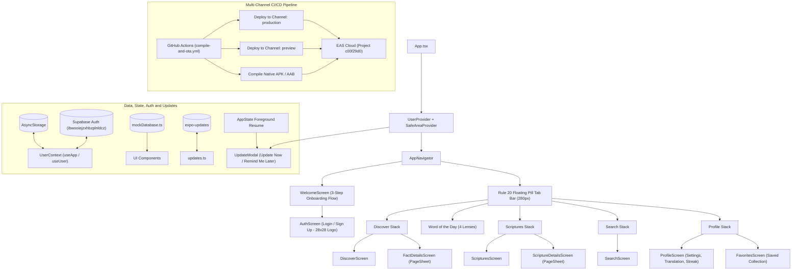

# exégeomai (ἐξηγέομαι)

<p align="left">
  
  
  
  
  
  
  
  
  
  
  
  
</p>

> **Strong's Greek 1834**: *ἐξηγέομαι* (*exēgeomai*) — from *ἐκ* (out) and *ἡγέομαι* (to lead): **"to lead out, unfold, declare, interpret, draw out the true meaning."** As recorded in John 1:18: *"No one has seen God at any time; the only begotten Son, who is in the bosom of the Father, He has explained / declared (exēgēsato) Him."*

**exégeomai** is a modern, high-performance React Native & Expo mobile application exploring ancient historical context, cultural customs, original language deep dives (Strong's Concordance), and multi-lens daily devotionals from Sacred Scripture.

---

## Architecture Overview



---

## Over-The-Air (OTA) Updates & Versioning Strategy

### 1. Dual-Channel Release Pipeline (`production` & `preview`)
EAS Update is configured with two distinct channels:
- **`production` Channel**: Bound to branch `production` for all end-user release builds.
- **`preview` Channel**: Bound to branch `preview` for internal testing APK builds.
- **Dual Deployment**: Pushes to `main` automatically publish OTA updates to both channels so that internal testers on preview APKs and production users receive updates concurrently.

### 2. Dual Versioning Model (Preserving `v1.0.1`)
- **Locked OTA & App Version**: `app.json` specifies `"version": "1.0.1"` and `"runtimeVersion": "1.0.1"`. All Over-The-Air updates deployed through EAS target runtime `1.0.1`.
- **Dynamic Native Compilation Build Numbers**: When native binaries are compiled through GitHub Actions or EAS Build, the CI pipeline automatically injects incremental build identifiers (`android.versionCode` and `ios.buildNumber`) derived from `github.run_number` while strictly preserving `1.0.1` as the base version and runtimeVersion.
- **Runtime Compatibility Guarantee**: Any compiled native application bearing runtimeVersion `1.0.1` will continuously and seamlessly receive OTA JavaScript and asset updates without triggering native version mismatches.

### 3. In-App Update Notification & Reminder Flow (Rule 15 & Rule 19)
The in-app update experience is implemented in `src/components/UpdateModal.tsx` and strictly adheres to Rule 15 and Rule 19 sizing specifications:
- **Logo Container**: `68x68` rounded surface container (`borderRadius: 18`, `backgroundColor: '#F8FAFC'`, border `rgba(15, 23, 42, 0.08)`).
- **Brand Logo Image**: Centered `50x50` logo with `borderRadius: 12`.
- **Update Actions**:
  - **"Update Now"**: Downloads the update and reloads the app immediately with fresh code and assets.
  - **"Remind Me Later"**: Snoozes the notification for 30 minutes.
- **Foreground Resume Detection**: Uses `AppState.addEventListener('change', ...)` to dynamically check for fresh updates whenever the user returns to the app from the background.
- **Aesthetic**: Pure white surface card (`#FFFFFF`), biblical amber gold action button (`#D97706`), clean typography, and zero status badges per Rule 16.

### 4. Automated GitHub Actions Workflow (`compile-and-ota.yml`)
The workflow `.github/workflows/compile-and-ota.yml` coordinates automated deployments:
- **Automatic OTA Publish**: Triggered on push to `main` when application code changes. Compiles the JS bundle, validates TypeScript, and publishes directly to both `production` and `preview` channels.
- **Manual Native Compilation**: Triggered via `workflow_dispatch` with parameters for platform (`android`, `ios`, `all`), build profile (`preview`, `production`, `development`), target OTA channel (`both`, `production`, `preview`), and custom build numbers.

---

## Design System & Specifications

The application strictly implements the **60-30-10 Design Rule**, the **Mobile Tab Navigation Standard (`/tabs`)**, and layout metrics:

### 1. 60-30-10 Color Hierarchy (Rule 1 & Rule 20)
- **60% Dominant Background**: Clean Slate Canvas (`#F8FAFC`) with Secondary Canvas (`#F1F5F9`)
- **30% Panel / Surface**: Pure White (`#FFFFFF`) cards, headers, modal sheets, and floating pill tab bar with hairline borders (`rgba(15, 23, 42, 0.08)`) and soft elevation shadow (`shadowColor: '#0F172A'`)
- **10% Accent**: Biblical Amber Gold (`#D97706`) with soft tint (`rgba(217, 119, 6, 0.12)`) and accent border (`rgba(217, 119, 6, 0.24)`)
- **Monochromatic Typography**: Primary Text (`#0F172A`), Secondary Slate (`#64748B`), and Muted Slate (`#94A3B8`)
- *Strict Rule: No rainbow status tags, review badges, or ad-hoc coloring.*

### 2. Mobile Tab Navigation Standard (`/tabs` - Rule 20)
The bottom navigation bar adheres strictly to the floating pill / curved rectangular architecture:
- **Position & Geometry**: `position: 'absolute'`, `bottom: Platform.OS === 'ios' ? 28 : 24`
- **Bounded Pill Width**: Explicit `width: 280`, dynamically centered horizontally using `useWindowDimensions()` via `marginHorizontal: (width - 280) / 2`
- **Compact Height & Shape**: `height: 50`, `paddingTop: 4`, `paddingBottom: 4`, `borderRadius: 16`
- **Surface & Shadow**: `backgroundColor: '#FFFFFF'` (30% panel surface), hairline border `borderWidth: 1, borderColor: 'rgba(15, 23, 42, 0.08)', borderTopWidth: 0`, soft elevation shadow (`shadowColor: '#0F172A', shadowOffset: { width: 0, height: 8 }, shadowOpacity: 0.08, shadowRadius: 12, elevation: 5`)
- **Dynamic Context State**: Reads `hideTabBar` and `accent` from `useApp()` hook
- **Custom Label with Focused Indicator Dot**: Centered column with `fontSize: 8.5`, `fontWeight: focused ? '700' : '500'`, `color: focused ? accent : '#64748B'`, and when `focused`, a `4x4` rounded dot (`width: 4, height: 4, borderRadius: 2, backgroundColor: accent, marginTop: 2`)
- **Iconography**: Pure vector `16px` SVGs (`react-native-svg`) adhering strictly to Rule 2 and Rule 4 (zero emojis, zero built-in icon fonts):
  - Feed / Discover: `DiscoverSvg`
  - Word of the Day: `WotdSvg`
  - Scriptures Library: `ScripturesSvg`
  - Search & Explore: `SearchSvg`
  - Profile & Settings: `ProfileSvg` (replaces Saved; Saved Collection is nested within Profile)
- **Header Standard**: Flat clean white header (`backgroundColor: '#FFFFFF', shadowColor: 'transparent', elevation: 0, borderBottomWidth: 1, borderBottomColor: 'rgba(15, 23, 42, 0.08)'`), `fontFamily: 'SpaceMono', fontSize: 18`. Across all 5 tabs (Feed, Word, Verses, Search, Profile), the header persistently displays the `24x24` transparent brand logo and `exégeomai` brand title without changing text between tabs.

### 3. App Icon, Launcher & In-App Logo Calibration (Rule 15 & Rule 19)
- **Android Adaptive Launcher Icon**: `assets/android-icon-foreground.png` is centered on a `512x512` canvas with a target icon height of `96px` (bounding box ~`74x96px`), providing ~`72%` clean white breathing room so Samsung One UI squircle masks and standard Android launcher cutouts never crop or zoom into the icon. Background is solid `#FFFFFF`.
- **In-App Transparent Brand Icon**: `assets/logo-transparent.png` is a `1024x1024` RGBA canvas with an `800px` symbol and zero background, ensuring pristine, borderless rendering across light and elevated surfaces.
- **Component In-App Logo Sizing**:
  - Header brand logos: `24x24` (zero background, transparent)
  - Auth / Login / Register logos: `28x28` (zero background, transparent)
  - In-app update / modal logos: `50x50` (zero background, transparent) inside a clean borderless container
- **Clean Modal Design**: `UpdateModal.tsx` implements clean `0px` border radius on modal cards and buttons for a modern, sharp presentation.

### 4. Spacing Grid (Multiples of 8px) & Scroll Clearance
All margins, paddings, gaps, and component dimensions follow strict multiples of **8px**:
- `spacing.sm`: `8px`
- `spacing.md`: `16px` (Standard screen margin and gutter)
- `spacing.lg`: `24px`
- `spacing.xl`: `32px`
- `spacing.xxl`: `48px`
- `spacing.nav`: `56px`
- `spacing.huge`: `64px`
- **Bottom Content Clearance**: All scrollable screens implement `paddingBottom: 96` (`12 * 8px`) so card content can be scrolled completely clear of the floating pill tab bar.

### 5. Profile & Authentication Architecture
- **Profile Tab & Nested Saved Collection**: The fifth navigation tab features `ProfileScreen`, replacing the standalone Saved tab. It houses user identity, daily study streaks (`FlameSvg`), facts unfolded count (`StrongsIconSvg`), and one-tap access to the **Saved Collection** (`FavoritesScreen`).
- **AVIF Profile Picture Upload**: Direct avatar selection and conversion using `expo-image-picker` and `expo-image-manipulator`, storing compressed lightweight AVIF images directly in Supabase Storage (`avatars` bucket).
- **Dedicated Login & Multi-Step Registration**: `AuthScreen.tsx` provides toggleable **Sign In** and **Create Account** views with vector input icons (`UserSvg`, `MailSvg`, `LockSvg`), password visibility toggle, real-time username availability checks, password strength progress bar, study preferences, and calibrated **28x28** brand logos per Rule 15/19.
- **Pure Vector SVGs & Zero Badges**: Strictly adheres to Rule 2 and Rule 4 (zero emojis, zero icon font libraries) and Rule 16 (zero development/status badges).

---

## Directory Structure

```text
exegeomai/
├── .github/
│   └── workflows/
│       └── compile-and-ota.yml           # GitHub Actions workflow for native compile and dual-channel OTA updates
├── assets/                               # Calibrated brand assets
│   ├── adaptive-icon.png                 # Android adaptive icon (512x512, 96px symbol, #FFFFFF background)
│   ├── android-icon-foreground.png       # Android launcher foreground (512x512, 96px symbol, ~72% breathing room)
│   ├── favicon.png                       # Browser favicon
│   ├── icon.png                          # Master brand icon (1024x1024, 800px symbol)
│   ├── logo-transparent.png              # In-app transparent brand icon (1024x1024, zero background)
│   └── splash-icon.png                   # Launch & splash screen branding asset
├── src/
│   ├── components/                       # Modular UI components
│   │   ├── Card.tsx                      # Surface-contained cards with 8px spacing
│   │   ├── CustomTabBar.tsx              # Rule 20 floating pill tab navigation component
│   │   ├── FactCard.tsx                  # Biblical fact card with Strong's deep dive
│   │   ├── ScriptureCard.tsx             # Scripture card with genre vector badges
│   │   ├── SearchBar.tsx                 # Search input with clear button and chips
│   │   ├── SvgIcons.tsx                  # Pure vector SVG library (zero emojis)
│   │   ├── Typography.tsx                # Monochromatic typography hierarchy
│   │   ├── UpdateModal.tsx               # OTA update modal (50x50 logo in 68x68 container, Remind Me Later snooze)
│   │   └── WOTDCard.tsx                  # Word of the Day devotional card
│   ├── context/
│   │   └── UserContext.tsx               # State management with useApp, useUser & Supabase Auth hooks
│   ├── data/
│   │   └── mockDatabase.ts               # Curated scriptures, facts, and Strong's database
│   ├── navigation/
│   │   └── AppNavigator.tsx              # Rule 20 floating pill tab navigation & stack navigators
│   ├── screens/                          # Application views
│   │   ├── AuthScreen.tsx                # Dedicated Login & Sign Up with 28x28 calibrated logo
│   │   ├── DiscoverScreen.tsx            # Daily fact discovery view (paddingBottom: 96)
│   │   ├── FactDetailsScreen.tsx         # In-depth modal sheet for biblical facts
│   │   ├── FavoritesScreen.tsx           # Saved collection (Facts, Scriptures, WOTD)
│   │   ├── HomeScreen.tsx                # Alternate home showcase
│   │   ├── ProfileScreen.tsx             # Profile tab (Study streak, translation, Saved, Sign out)
│   │   ├── ScriptureDetailsScreen.tsx    # In-depth modal sheet for scripture texts
│   │   ├── ScripturesScreen.tsx          # Categorized scripture library
│   │   ├── SearchScreen.tsx              # Unified search interface
│   │   ├── WelcomeScreen.tsx             # 3-step onboarding flow with custom vector art & dual CTAs
│   │   ├── WOTDDetailsScreen.tsx         # Deep-dive view for Word of the Day
│   │   └── WOTDScreen.tsx                # Daily devotional with 4 analytical lenses
│   ├── services/
│   │   ├── notifications.ts              # Expo notifications handler and scheduler
│   │   ├── supabase.ts                   # Supabase client SDK with AsyncStorage persistence
│   │   └── updates.ts                    # Expo OTA updates check, download, and reload service
│   └── theme/
│       ├── colors.ts                     # Strict 60-30-10 light theme tokens
│       └── index.ts                      # Spacing (8px grid), pillTabBar specs, and soft shadows
├── scripts/                              # Database seeding and development automation
│   └── seed_database.ts                  # Canonical content extraction and SQL seeder generator
├── supabase/                             # Supabase CLI project configuration
│   ├── config.toml                       # Supabase local and remote configuration
│   ├── seed.sql                          # Production seed dataset (categories, facts, scriptures, WOTD)
│   ├── migrations/                       # Database schema and RLS policies
│   │   ├── 20260920000000_create_profiles_and_avatars.sql # profiles table, trigger, and avatars bucket
│   │   └── 20260920000001_create_production_schema.sql   # Complete 8-table relational production schema
│   └── .gitignore                        # Supabase ignore rules
├── .env.example                          # Environment template for all Supabase connections
├── .gitignore                            # Standard git exclusion rules (includes .env and .agents)
├── .npmrc                                # npm configuration (legacy-peer-deps=true)
├── App.tsx                               # Root container, Dark StatusBar, providers, and UpdateModal
├── app.json                              # Expo configuration (v1.0.1, runtimeVersion 1.0.1, updates URL)
├── eas.json                              # EAS build profiles and update channels (production, preview)
├── index.ts                              # Expo entrypoint
├── package.json                          # Dependencies (@supabase/supabase-js, expo-image-picker)
├── tsconfig.json                         # TypeScript compiler configuration (extends expo/tsconfig.base.json)
└── README.md                             # Comprehensive project architecture guide
```

---

## 3-Step Welcome & Onboarding Screen Flow

Immediately after the application boots up, new and unauthenticated users are guided through an elegant, interactive 3-step Welcome & Onboarding walkthrough before reaching Login or Sign Up:

### 1. Slide 1: Welcome to exégeomai
- **Narrative**: *"We hope this sacred companion illuminates God's Word in your heart. Explore the timeless treasures of Scripture with rich historical, linguistic, and ancient cultural clarity."*
- **Visual Spec**: `WelcomeScripturesArtSvg` — Custom high-resolution vector illustration of the open Scriptures illuminated by divine rays of holy light and sacred aura.
- **Action**: Step indicator + circular forward button with white Chevron SVG (`#FFFFFF`) on amber background (`#D97706`).

### 2. Slide 2: What Does exégeomai Mean?
- **Ancient Root**: *ἐξηγέομαι (Strong's Greek 1834)*
- **Narrative**: *"From ἐκ (out) and ἡγέομαι (to lead) — 'to lead out, unfold, declare, and draw out the true meaning.' Just as Christ declared the Father, exégeomai unfolds the profound depth and original intent of Sacred Scripture."*
- **Visual Spec**: `ExegeomaiMeaningArtSvg` — Custom vector artwork of an ancient unfolding parchment scroll with Strong's concordance magnifying glass and Greek letterform motifs.
- **Action**: Step indicator + circular forward button to proceed to the purpose slide.

### 3. Slide 3: Our Sacred Purpose & Launch CTAs
- **Narrative**: *"This application was created to help you better understand the scriptures, deepen your knowledge in the glory of the Lord, and strengthen your everyday walk of faith through sound biblical exegesis."*
- **Visual Spec**: `SacredPurposeArtSvg` — Custom vector illustration depicting the ascending path of discipleship, the shield of faith, and the glory of the Lord.
- **Primary CTA**: **"Get Started"** — Full-width button navigating directly into the 4-step Sign Up wizard.
- **Secondary CTA**: **"Already have an account? Sign In"** — Navigates directly to Login mode.
- **Header Skip Action**: "Skip" button located in the top-right header on Slides 1 & 2 allows users to jump straight into the application without swiping through all slides.

---

## Supabase Relational Database Architecture (`ibwooiejzxhbzplnldcz`)

The application is backed by a full production-ready relational schema on Supabase with Row Level Security (RLS) enabled across every table:

| Table | Purpose | Row Level Security (RLS) | Seeded Records |
| :--- | :--- | :--- | :--- |
| **`public.profiles`** | User account identity, theological goals, translation preferences, and AVIF avatar URLs. | Public read; owner-restricted insert and update. | Dynamic (on signup) |
| **`public.categories`** | Canonical biblical categories (`History`, `Language`, `People`, `Prophecy`, `Customs`). | Public read (`USING (true)`). | 5 categories |
| **`public.facts`** | Curated historical, cultural, and Strong's concordance biblical facts with verification state. | Public read (`USING (true)`). | 120 facts |
| **`public.scriptures`** | Canonical scripture library passages with genre, testament, historical context, and Strong's data. | Public read (`USING (true)`). | 24 scriptures |
| **`public.word_of_the_day`** | Daily devotional readings with 4 analytical lenses, memory verses, and prayer prompts. | Public read (`USING (true)`). | Canonical entry |
| **`public.user_favorites_facts`** | User-saved biblical facts collection with cascade deletion on user removal. | Owner-restricted select, insert, and delete (`auth.uid() = user_id`). | User-generated |
| **`public.user_favorites_scriptures`** | User-saved scripture passages collection. | Owner-restricted select, insert, and delete (`auth.uid() = user_id`). | User-generated |
| **`public.user_study_progress`** | Tracks completed daily devotionals and reading streaks per authenticated user. | Owner-restricted select, insert, and delete (`auth.uid() = user_id`). | User-generated |
| **`public.study_notes`** | User-authored exegesis notes, reflections, and cross-references linked to scripture verses. | Owner-restricted select, insert, update, delete (`auth.uid() = user_id`). | User-generated |

---

## Clean UI Architecture & Zero Badge Standard (Rule 16)

In strict adherence to Rule 16 and clean typography principles:
- **Zero Status Badges & Pill Containers**: All status tags, rounded background pills, and card badge indicators have been completely eliminated across all screens and components (`FactCard`, `ScriptureCard`, `WOTDCard`, `DiscoverScreen`, `FactDetailsScreen`, `ScripturesScreen`, `ScriptureDetailsScreen`, `SearchScreen`, `WOTDScreen`, `WOTDDetailsScreen`).
- **Clean Inline Metadata**: Metadata (such as categories, testaments, genres, and dates) is rendered as clean, high-contrast inline typography (`Category • Testament • Genre`) without artificial container borders or colored badge backgrounds.
- **Analytical Lens Navigation**: The 4 analytical perspectives (*Original Intent*, *Theological Truth*, *Modern Walk*, *Prayer Focus*) are structured as clean, minimalist segmented tabs with active amber underlines rather than boxed badge buttons.
- **Zero Star Icons / Emojis**: Removed star shapes across the entire application; `DiscoverSvg` has been redesigned as a precision navigation compass needle.

---

## Multi-Step Authentication & AVIF Profile Storage

The mobile client integrates with Supabase for user authentication, profile data persistence, and compressed avatar storage:

### 1. Multi-Step Sign Up Wizard (4 Steps)
- **Step 1: Personal Identity & Username**: First name, last name, and desired username with real-time availability check (queries reserved names and Supabase `profiles` table).
- **Step 2: Contact & Verification**: Email address and confirmation email with real-time match verification.
- **Step 3: Security & Credentials**: Password with 4-segment **60-30-10 Strength Progress Bar** (minimum 8 characters, uppercase, number, symbol) and confirm password matching.
- **Step 4: Biblical Study Journey**: Captures preferred translation (`ESV`, `KJV`, `NASB`, `NIV`, `CSB`), study focus area (Original Languages, Historical Context, Devotionals, Theology), daily study cadence, and journey stage.

### 2. AVIF Profile Picture Upload & Compression
- In the **Profile** tab, users can tap their avatar to select a profile photo from the camera roll.
- The image is processed and compressed via `expo-image-manipulator` into ultra-lightweight format (`image/avif`) before uploading to the Supabase Storage `avatars` bucket at `${userId}/avatar_${timestamp}.avif`.
- This ensures maximum visual fidelity while consuming minimal cloud storage space (< 50KB per avatar).

### 3. Environment Configuration (`.env`)
- `EXPO_PUBLIC_SUPABASE_URL`: `https://ibwooiejzxhbzplnldcz.supabase.co`
- `EXPO_PUBLIC_SUPABASE_ANON_KEY`: Supabase project anon key.
- `SUPABASE_DB_URL`: Direct Postgres pooled connection string for schema migrations and administrative queries.

---

## Rule 21: Mobile CI/CD & Native Compilation Architecture

This project strictly adheres to **Rule 21** of our global mobile standards:

| Standard | Implementation in `exégeomai` |
| :--- | :--- |
| **Direct Runner Compilation** | Android APKs compile on `ubuntu-latest` GitHub Actions runners using Java 17 Temurin, Android SDK, and `./gradlew assembleRelease`, bypassing cloud build queues entirely. |
| **EAS Exclusively for OTA** | EAS CLI is reserved exclusively for Over-The-Air updates (`production` and `preview` channels) via `npx eas-cli update`. |
| **Automated Release Distribution** | Compiled APKs are automatically uploaded to GitHub Releases (`exegeomai-v1.0.1.apk`) using `gh release upload --clobber`. |
| **Locked Runtime Versioning** | `runtimeVersion` is explicitly locked to `1.0.1` in `app.json`, guaranteeing continuous OTA compatibility while CI injects dynamic `versionCode = github.run_number`. |
| **In-App Update Modal** | Implemented in `src/components/UpdateModal.tsx` with foreground resume listening, "Update Now", and 30-minute "Remind Me Later" snooze. |
| **Peer Dependency Stability** | `.npmrc` with `legacy-peer-deps=true` committed at root to prevent React 19 / Expo peer dependency collisions. |
| **TypeScript Base Config** | `tsconfig.json` extends `expo/tsconfig.base.json` with explicit `jsx: "react-jsx"` and `esModuleInterop: true`. |
| **JVM Memory & Runner Stability** | Gradle configured with `-Xmx4096m -XX:MaxMetaspaceSize=1024m` and explicit `timeout-minutes` (35 min compile, 15 min OTA) to prevent Metaspace OOM crashes and runner hangs. |

---

## Getting Started

### Prerequisites
- Node.js (v18+)
- npm (v10+)
- Expo SDK 57 (`npx expo`)
- EAS CLI (`npm install -g eas-cli`)
- Expo Go app or EAS Development Client on Android or iOS

### Installation
```bash
npm install
```

### Running Locally (Rule 15 Concurrently Runner)
Development uses `concurrently --kill-others-on-fail --raw` with fixed port `8082` to avoid interactive prompts and render the Expo QR code cleanly:

```bash
npm run dev
```

### Publishing Over-The-Air (OTA) Updates
```bash
# Publish an OTA update to the production channel (targets runtimeVersion 1.0.1)
npx eas-cli update --branch production --message "Update description"

# Publish an OTA update to the preview channel
npx eas-cli update --branch preview --message "Preview update description"
```

### Compiling Native Binaries on GitHub Actions
Native compilation runs automatically on push to `main` directly on GitHub Actions compute runners (Java 17 + runner-native Android SDK + Gradle) without relying on EAS Cloud build servers:

- **Workflow**: `.github/workflows/compile-and-ota.yml` (`compile_native_app` job)
- **Engine**: `npx expo prebuild --platform android --no-install` + `./gradlew assembleRelease -x lint -x test --no-daemon`
- **Output**: Generates `exegeomai-v1.0.1.apk` and uploads it directly to the repository's GitHub Releases page under **Assets** with automatic clobbering.

### GitHub Releases vs. Over-The-Air (OTA) Updates
- **GitHub Releases (`/releases`)**: Houses official version tags (e.g. `v1.0.1`), changelogs, and direct `.apk` binary downloads compiled directly on GitHub Actions.
- **Expo EAS OTA Updates**: Seamless JavaScript and asset updates deployed directly to user devices over the air across the `production` and `preview` channels without requiring a manual APK reinstall.

### Type Checking & Validation
```bash
npx tsc --noEmit
```

---

## License & Credits
Crafted for Scripture scholars, Bible study groups, and everyday believers seeking the deeper historical, linguistic, and cultural dimensions of God's Word.
